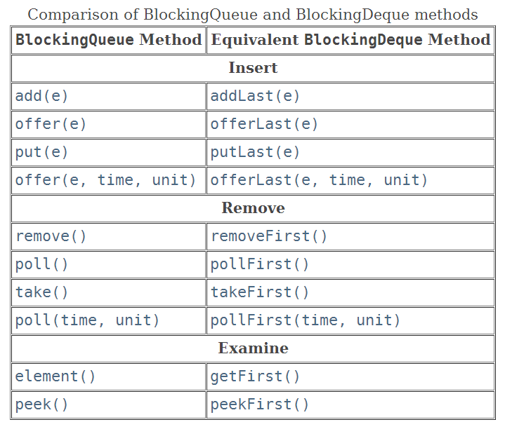

::: tip 说明

并发容器之BlockingQueue

:::

<!-- more -->

[[toc]]

# 并发容器之BlockingQueue

## 1、BlockingQueue简介

在实际编程中，会经常使用到JDK中Collection集合框架中的各种容器类如实现List,Map,Queue接口的容器类，但是这些容器类基本上不是线程安全的，除了使用Collections可以将其转换为线程安全的容器，Doug Lea大师为我们都准备了对应的线程安全的容器，如实现List接口的CopyOnWriteArrayList，实现Map接口的ConcurrentHashMap，实现Queue接口的ConcurrentLinkedQueue。

最常用的"**生产者-消费者**"问题中，队列通常被视作线程间操作的数据容器，这样，可以对各个模块的业务功能进行解耦，生产者将“生产”出来的数据放置在数据容器中，而消费者仅仅只需要在“数据容器”中进行获取数据即可，这样生产者线程和消费者线程就能够进行解耦，只专注于自己的业务功能即可。阻塞队列（BlockingQueue）被广泛使用在“生产者-消费者”问题中，其原因是BlockingQueue提供了可阻塞的插入和移除的方法。**当队列容器已满，生产者线程会被阻塞，直到队列未满；当队列容器为空时，消费者线程会被阻塞，直至队列非空时为止。**

## 2、基本操作

插入和移除操作的4种处理方式：

 

- 抛出异常：当队列满时，如果再往队列里插入元素，会抛出IllegalStateException（"Queue full"）异常。当队列空时，从队列里获取元素会抛出NoSuchElementException异常。
- 返回特殊值：当往队列插入元素时，会返回元素是否插入成功，成功返回true。如果是移除方法，则是从队列里取出一个元素，如果没有则返回null。
- 一直阻塞：当阻塞队列满时，如果生产者线程往队列里put元素，队列会一直阻塞生产者线程，直到队列可用或者响应中断退出。当队列空时，如果消费者线程从队列里take元素，队列会阻塞住消费者线程，直到队列不为空。
- 超时退出：当阻塞队列满时，如果生产者线程往队列里插入元素，队列会阻塞生产者线程一段时间，如果超过了指定的时间，生产者线程就会退出。

## 3、常用的BlockingQueue

实现BlockingQueue接口的有`ArrayBlockingQueue, DelayQueue, LinkedBlockingDeque, LinkedBlockingQueue, LinkedTransferQueue, PriorityBlockingQueue, SynchronousQueue`，而这几种常见的阻塞队列也是在实际编程中会常用的，下面对这几种常见的阻塞队列进行说明：

> **ArrayBlockingQueue**

**ArrayBlockingQueue**是由数组实现的有界阻塞队列。该队列命令元素FIFO（先进先出）。因此，队头元素是队列中存在时间最长的数据元素，而对尾数据则是当前队列最新的数据元素。ArrayBlockingQueue可作为“有界数据缓冲区”，生产者插入数据到队列容器中，并由消费者提取。ArrayBlockingQueue一旦创建，容量不能改变。

当队列容量满时，尝试将元素放入队列将导致操作阻塞；尝试从一个空队列中取一个元素也会同样阻塞。

ArrayBlockingQueue默认情况下不能保证线程访问队列的公平性，所谓公平性是指严格按照线程等待的绝对时间顺序，即最先等待的线程能够最先访问到ArrayBlockingQueue。而非公平性则是指访问ArrayBlockingQueue的顺序不是遵守严格的时间顺序，有可能存在，一旦ArrayBlockingQueue可以被访问时，长时间阻塞的线程依然无法访问到ArrayBlockingQueue。**如果保证公平性，通常会降低吞吐量**。如果需要获得公平性的ArrayBlockingQueue，可采用如下代码：

```java
private static ArrayBlockingQueue<Integer> blockingQueue = new ArrayBlockingQueue<Integer>(10,true);
```

访问者的公平性是使用可重入锁实现的，代码如下：

```java
public ArrayBlockingQueue(int capacity, boolean fair) {
    if (capacity <= 0)
        throw new IllegalArgumentException();
    this.items = new Object[capacity];
    lock = new ReentrantLock(fair);
    notEmpty = lock.newCondition();
    notFull = lock.newCondition();
}
```

关于ArrayBlockingQueue的实现原理，可以[看这篇文章](https://juejin.im/post/5aeebdb26fb9a07aa83ea17e)。

> **LinkedBlockingQueue**

LinkedBlockingQueue是用链表实现的有界阻塞队列，同样满足FIFO的特性，与ArrayBlockingQueue相比起来具有更高的吞吐量，为了防止LinkedBlockingQueue容量迅速增，损耗大量内存。通常在创建LinkedBlockingQueue对象时，会指定其大小，如果未指定，容量等于Integer.MAX_VALUE

> **PriorityBlockingQueue**

PriorityBlockingQueue是一个支持优先级的无界阻塞队列。默认情况下元素采用自然顺序进行排序，也可以通过自定义类实现compareTo()方法来指定元素排序规则，或者初始化时通过构造器参数Comparator来指定排序规则。

> **SynchronousQueue**

SynchronousQueue每个插入操作必须等待另一个线程进行相应的删除操作，因此，SynchronousQueue实际上没有存储任何数据元素，因为只有线程在删除数据时，其他线程才能插入数据，同样的，如果当前有线程在插入数据时，线程才能删除数据。SynchronousQueue也可以通过构造器参数来为其指定公平性。

> **LinkedTransferQueue**

LinkedTransferQueue是一个由链表数据结构构成的无界阻塞队列，由于该队列实现了TransferQueue接口，与其他阻塞队列相比主要有以下不同的方法：

- `transfer(E e)`：如果当前有线程（消费者）正在调用take()方法或者可延时的poll()方法进行消费数据时，生产者线程可以调用transfer方法将数据传递给消费者线程。如果当前没有消费者线程的话，生产者线程就会将数据插入到队尾，直到有消费者能够进行消费才能退出；
- `tryTransfer(E e)`：tryTransfer方法如果当前有消费者线程（调用take方法或者具有超时特性的poll方法）正在消费数据的话，该方法可以将数据立即传送给消费者线程，如果当前没有消费者线程消费数据的话，就立即返回`false`。因此，与transfer方法相比，transfer方法是必须等到有消费者线程消费数据时，生产者线程才能够返回。而tryTransfer方法能够立即返回结果退出。
- `tryTransfer(E e,long timeout,imeUnit unit)`：与transfer基本功能一样，只是增加了超时特性，如果数据才规定的超时时间内没有消费者进行消费的话，就返回`false`。

> **LinkedBlockingDeque**

LinkedBlockingDeque是基于链表数据结构的有界阻塞双端队列，如果在创建对象时为指定大小时，其默认大小为Integer.MAX_VALUE。与LinkedBlockingQueue相比，主要的不同点在于，LinkedBlockingDeque具有双端队列的特性。LinkedBlockingDeque基本操作如下图所示：


如上图所示，LinkedBlockingDeque的基本操作可以分为四种类型：1.特殊情况，抛出异常；2.特殊情况，返回特殊值如null或者false；3.当线程不满足操作条件时，线程会被阻塞直至条件满足；4. 操作具有超时特性。

另外，LinkedBlockingDeque实现了BlockingDueue接口而LinkedBlockingQueue实现的是BlockingQueue，这两个接口的主要区别如下图所示：

 

从上图可以看出，两个接口的功能是可以等价使用的，比如BlockingQueue的add方法和BlockingDeque的addLast方法的功能是一样的。

> **DelayQueue**

DelayQueue是一个存放实现Delayed接口的数据的无界阻塞队列，只有当数据对象的延时时间达到时才能插入到队列进行存储。如果当前所有的数据都还没有达到创建时所指定的延时期，则队列没有队头，并且线程通过poll等方法获取数据元素则返回null。所谓数据延时期满时，则是通过Delayed接口的`getDelay(TimeUnit.NANOSECONDS)`来进行判定，如果该方法返回的是小于等于0则说明该数据元素的延时期已满。

## 4、ArrayBlockingQueue

### 4.1 ArrayBlockingQueue简介

在多线程编程过程中，为了业务解耦和架构设计，经常会使用并发容器用于存储多线程间的共享数据，这样不仅可以保证线程安全，还可以简化各个线程操作。例如在“生产者-消费者”问题中，会使用阻塞队列（BlockingQueue）作为数据容器。为了加深对阻塞队列的理解，唯一的方式是对其实验原理进行理解，这篇文章就主要来看看ArrayBlockingQueue和LinkedBlockingQueue的实现原理。

### 4.2 ArrayBlockingQueue实现原理

阻塞队列最核心的功能是，能够可阻塞式的插入和删除队列元素。当前队列为空时，会阻塞消费数据的线程，直至队列非空时，通知被阻塞的线程；当队列满时，会阻塞插入数据的线程，直至队列未满时，通知插入数据的线程（生产者线程）。那么，多线程中消息通知机制最常用的是lock的condition机制，关于condition可以看前面文章的详细介绍。那么ArrayBlockingQueue的实现是不是也会采用Condition的通知机制呢？下面来看看。

### 4.3 ArrayBlockingQueue的主要属性

ArrayBlockingQueue的主要属性如下:

```java
/** The queued items */
final Object[] items;

/** items index for next take, poll, peek or remove */
int takeIndex;

/** items index for next put, offer, or add */
int putIndex;

/** Number of elements in the queue */
int count;

/*
 * Concurrency control uses the classic two-condition algorithm
 * found in any textbook.
 */

/** Main lock guarding all access */
final ReentrantLock lock;

/** Condition for waiting takes */
private final Condition notEmpty;

/** Condition for waiting puts */
private final Condition notFull;
```

从源码中可以看出ArrayBlockingQueue内部是采用数组进行数据存储的（`items`），为了保证线程安全，采用的是`ReentrantLock lock`，为了保证可阻塞式的插入删除数据利用的是Condition，当获取数据的消费者线程被阻塞时会将该线程放置到notEmpty等待队列中，当插入数据的生产者线程被阻塞时，会将该线程放置到notFull等待队列中。而notEmpty和notFull等中要属性在构造方法中进行创建：

```java
public ArrayBlockingQueue(int capacity, boolean fair) {
    if (capacity <= 0)
        throw new IllegalArgumentException();
    this.items = new Object[capacity];
    lock = new ReentrantLock(fair);
    notEmpty = lock.newCondition();
    notFull =  lock.newCondition();
}
```

接下来，主要看看可阻塞式的put和take方法是怎样实现的。

### 4.4 put方法详解

`put(E e)`方法源码如下：

```java
public void put(E e) throws InterruptedException {
    checkNotNull(e);
    final ReentrantLock lock = this.lock;
    lock.lockInterruptibly();
    try {
		//如果当前队列已满，将线程移入到notFull等待队列中
        while (count == items.length)
            notFull.await();
		//满足插入数据的要求，直接进行入队操作
        enqueue(e);
    } finally {
        lock.unlock();
    }
}
```

该方法的逻辑很简单，当队列已满时（`count == items.length`）将线程移入到notFull等待队列中，如果当前满足插入数据的条件，就可以直接调用` enqueue(e)`插入数据元素。enqueue方法源码为：

```java
private void enqueue(E x) {
    // assert lock.getHoldCount() == 1;
    // assert items[putIndex] == null;
    final Object[] items = this.items;
	//插入数据
    items[putIndex] = x;
    if (++putIndex == items.length)
        putIndex = 0;
    count++;
	//通知消费者线程，当前队列中有数据可供消费
    notEmpty.signal();
}
```

enqueue方法的逻辑同样也很简单，先完成插入数据，即往数组中添加数据（`items[putIndex] = x`），然后通知被阻塞的消费者线程，当前队列中有数据可供消费（`notEmpty.signal()`）。

### 4.5 take方法详解

take方法源码如下：

```java
public E take() throws InterruptedException {
    final ReentrantLock lock = this.lock;
    lock.lockInterruptibly();
    try {
		//如果队列为空，没有数据，将消费者线程移入等待队列中
        while (count == 0)
            notEmpty.await();
		//获取数据
        return dequeue();
    } finally {
        lock.unlock();
    }
}
```

take方法也主要做了两步：1. 如果当前队列为空的话，则将获取数据的消费者线程移入到等待队列中；2. 若队列不为空则获取数据，即完成出队操作`dequeue`。dequeue方法源码为：

```java
private E dequeue() {
    // assert lock.getHoldCount() == 1;
    // assert items[takeIndex] != null;
    final Object[] items = this.items;
    @SuppressWarnings("unchecked")
	//获取数据
    E x = (E) items[takeIndex];
    items[takeIndex] = null;
    if (++takeIndex == items.length)
        takeIndex = 0;
    count--;
    if (itrs != null)
        itrs.elementDequeued();
    //通知被阻塞的生产者线程
	notFull.signal();
    return x;
}
```

dequeue方法也主要做了两件事情：1. 获取队列中的数据，即获取数组中的数据元素（`(E) items[takeIndex]`）；2. 通知notFull等待队列中的线程，使其由等待队列移入到同步队列中，使其能够有机会获得lock，并执行完成功退出。

从以上分析，可以看出put和take方法主要是通过condition的通知机制来完成可阻塞式的插入数据和获取数据。在理解ArrayBlockingQueue后再去理解LinkedBlockingQueue就很容易了。

## 5、LinkedBlockingQueue

LinkedBlockingQueue是用链表实现的有界阻塞队列，当构造对象时为指定队列大小时，队列默认大小为`Integer.MAX_VALUE`。从它的构造方法可以看出：

```java
public LinkedBlockingQueue() {
    this(Integer.MAX_VALUE);
}
```

### 5.1 LinkedBlockingQueue的主要属性

LinkedBlockingQueue的主要属性有：

```java
/** Current number of elements */
private final AtomicInteger count = new AtomicInteger();

/**
 * Head of linked list.
 * Invariant: head.item == null
 */
transient Node<E> head;

/**
 * Tail of linked list.
 * Invariant: last.next == null
 */
private transient Node<E> last;

/** Lock held by take, poll, etc */
private final ReentrantLock takeLock = new ReentrantLock();

/** Wait queue for waiting takes */
private final Condition notEmpty = takeLock.newCondition();

/** Lock held by put, offer, etc */
private final ReentrantLock putLock = new ReentrantLock();

/** Wait queue for waiting puts */
private final Condition notFull = putLock.newCondition();
```

可以看出与ArrayBlockingQueue主要的区别是，LinkedBlockingQueue在插入数据和删除数据时分别是由两个不同的lock（`takeLock`和`putLock`）来控制线程安全的，因此，也由这两个lock生成了两个对应的condition（`notEmpty`和`notFull`）来实现可阻塞的插入和删除数据。并且，采用了链表的数据结构来实现队列，Node结点的定义为：

```java
static class Node<E> {
    E item;

    /**
     * One of:
     * - the real successor Node
     * - this Node, meaning the successor is head.next
     * - null, meaning there is no successor (this is the last node)
     */
    Node<E> next;

    Node(E x) { item = x; }
}
```

接下来，我们也同样来看看put方法和take方法的实现。

### 5.2 put方法详解

put方法源码为:

```java
public void put(E e) throws InterruptedException {
    if (e == null) throw new NullPointerException();
    // Note: convention in all put/take/etc is to preset local var
    // holding count negative to indicate failure unless set.
    int c = -1;
    Node<E> node = new Node<E>(e);
    final ReentrantLock putLock = this.putLock;
    final AtomicInteger count = this.count;
    putLock.lockInterruptibly();
    try {
        /*
         * Note that count is used in wait guard even though it is
         * not protected by lock. This works because count can
         * only decrease at this point (all other puts are shut
         * out by lock), and we (or some other waiting put) are
         * signalled if it ever changes from capacity. Similarly
         * for all other uses of count in other wait guards.
         */
		//如果队列已满，则阻塞当前线程，将其移入等待队列
        while (count.get() == capacity) {
            notFull.await();
        }
		//入队操作，插入数据
        enqueue(node);
        c = count.getAndIncrement();
		//若队列满足插入数据的条件，则通知被阻塞的生产者线程
        if (c + 1 < capacity)
            notFull.signal();
    } finally {
        putLock.unlock();
    }
    if (c == 0)
        signalNotEmpty();
}
```

put方法的逻辑也同样很容易理解，可见注释。基本上和ArrayBlockingQueue的put方法一样。take方法的源码如下：

```java
public E take() throws InterruptedException {
    E x;
    int c = -1;
    final AtomicInteger count = this.count;
    final ReentrantLock takeLock = this.takeLock;
    takeLock.lockInterruptibly();
    try {
		//当前队列为空，则阻塞当前线程，将其移入到等待队列中，直至满足条件
        while (count.get() == 0) {
            notEmpty.await();
        }
		//移除队头元素，获取数据
        x = dequeue();
        c = count.getAndDecrement();
        //如果当前满足移除元素的条件，则通知被阻塞的消费者线程
		if (c > 1)
            notEmpty.signal();
    } finally {
        takeLock.unlock();
    }
    if (c == capacity)
        signalNotFull();
    return x;
}
```

take方法的主要逻辑请见于注释，也很容易理解。

## 6、两个阻塞队列的比较

**相同点**：

ArrayBlockingQueue和LinkedBlockingQueue都是通过condition通知机制来实现可阻塞式插入和删除元素，并满足线程安全的特性；

**不同点**：

1. ArrayBlockingQueue底层是采用的数组进行实现，而LinkedBlockingQueue则是采用链表数据结构；
2. ArrayBlockingQueue插入和删除数据，只采用了一个lock，而LinkedBlockingQueue则是在插入和删除分别采用了`putLock`和`takeLock`，这样可以降低线程由于线程无法获取到lock而进入WAITING状态的可能性，从而提高了线程并发执行的效率。

> 参考文献

《Java并发编程的艺术》