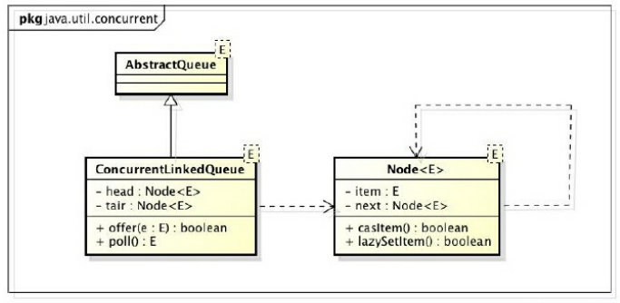
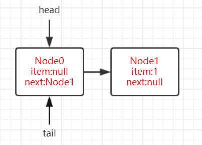
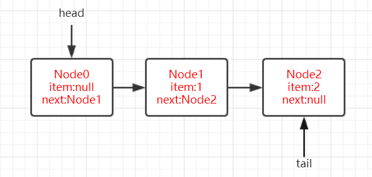
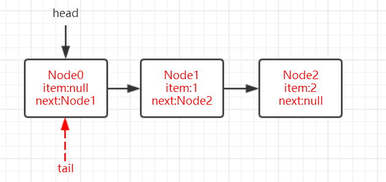
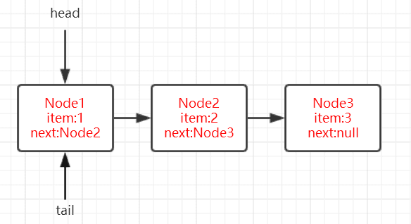
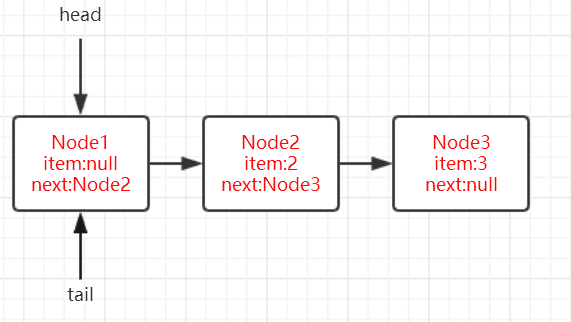
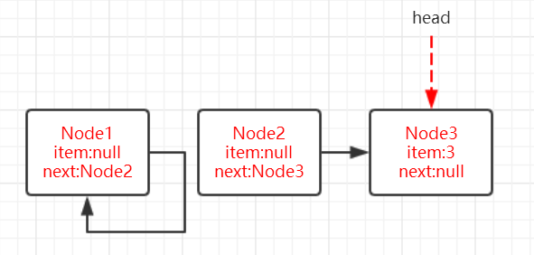
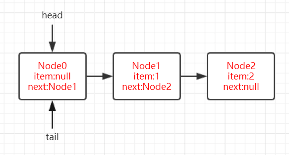
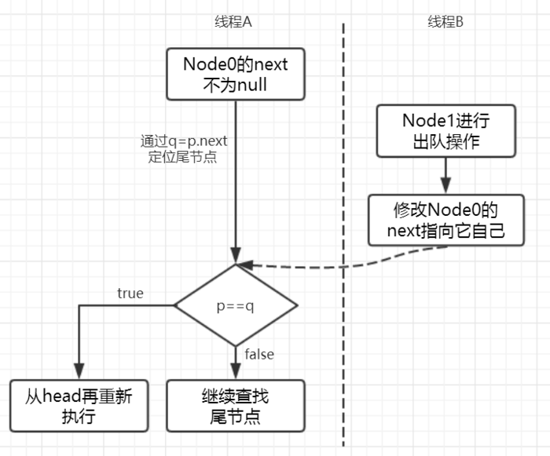
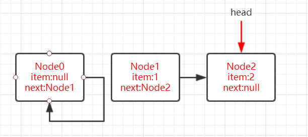

::: tip 说明

并发容器之ConcurrentLinkedQueue

:::

<!-- more -->

[[toc]]

# 并发容器之ConcurrentLinkedQueue

## 1、ConcurrentLinkedQueue简介

在单线程编程中我们会经常用到一些集合类，比如ArrayList,HashMap等，但是这些类都不是线程安全的类。在面试中也经常会有一些考点，比如ArrayList不是线程安全的，Vector是线程安全。而保障Vector线程安全的方式，是非常粗暴的在方法上用synchronized独占锁，将多线程执行变成串行化。要想将ArrayList变成线程安全的也可以使用`Collections.synchronizedList(List<T> list)`方法ArrayList转换成线程安全的，但这种转换方式依然是通过synchronized修饰方法实现的，很显然这不是一种高效的方式，同时，队列也是我们常用的一种数据结构，为了解决线程安全的问题，Doug Lea大师为我们准备了ConcurrentLinkedQueue这个线程安全的队列。从类名就可以看的出来实现队列的数据结构是链式。

ConcurrentLinkedQueue是一个基于链接节点的无界线程安全队列，它采用先进先出的规则对节点进行排序，当我们添加一个元素的时候，它会添加到队列的尾部；当我们获取一个元素时，它会返回队列头部的元素。它采用了“wait-free”算法（即CAS算法）来实现，该算法在 Michael&Scott 算法上进行了一些修改。

## 2、ConcurrentLinkedQueue的结构

通过ConcurrentLinkedQueue的类图来分析一下它的结构，如图所示：

 

ConcurrentLinkedQueue由head节点和tail节点组成，每个节点（Node）由数据域（item）和指向下一个节点（next）的引用组成，节点与节点之间就是通过这个next关联起来，从而组成一张链表结构的队列。默认情况下head节点存储的元素为空，tail节点等于head节点，当我们调用无参构造器时，其源码为：

```java
public ConcurrentLinkedQueue() {
    head = tail = new Node<E>(null);
}
```

## 3、操作Node的几个CAS操作

在队列进行出队入队的时候免不了对节点需要进行操作，在多线程就很容易出现线程安全的问题。可以看出在处理器指令集能够支持**CMPXCHG**指令后，在java源码中涉及到并发处理都会使用CAS操作，那么在ConcurrentLinkedQueue对Node的CAS操作有这样几个：

```java
//更改Node中的数据域item
boolean casItem(E cmp, E val) {
    return UNSAFE.compareAndSwapObject(this, itemOffset, cmp, val);
}
//更改Node中的指针域next
void lazySetNext(Node<E> val) {
    UNSAFE.putOrderedObject(this, nextOffset, val);
}
//更改Node中的指针域next
boolean casNext(Node<E> cmp, Node<E> val) {
    return UNSAFE.compareAndSwapObject(this, nextOffset, cmp, val);
}
```

可以看出这些方法实际上是通过调用UNSAFE实例的方法，UNSAFE为**sun.misc.Unsafe**类，该类是hotspot底层方法，目前为止了解即可，知道CAS的操作归根结底是由该类提供就好。

## 4、offer方法

对一个队列来说，插入满足FIFO特性，插入元素总是在队列最末尾的地方进行插入，而取（移除）元素总是从队列的队头。所有要想能够彻底弄懂ConcurrentLinkedQueue自然而然是从offer方法和poll方法开始。另外，在看多线程的代码时，可采用这样的思维方式：

> **单个线程offer**
>
> **多个线程offer**
>
> **部分线程offer，部分线程poll**
>
> - 当offer的速度快于poll：队列长度会越来越长，由于offer节点总是在对队列队尾，而poll节点总是在队列对头，也就是说offer线程和poll线程两者并无“交集”，也就是说两类线程间并不会相互影响，这种情况站在相对速率的角度来看，也就是一个"单线程offer"
> - 当offer的速度慢于poll：poll的相对速率快于offer，也就是队头删的速度要快于队尾添加节点的速度，导致的结果就是队列长度会越来越短，而offer线程和poll线程就会出现“交集”，即那一时刻就可以称之为offer线程和poll线程同时操作的节点为 **临界点** ，且在该节点offer线程和poll线程必定相互影响。根据在临界点时offer和poll发生的相对顺序又可从两个角度去思考：**1. 执行顺序为offer-->poll-->offer**，即表现为当offer线程在Node1后插入Node2时，此时poll线程已经将Node1删除，这种情况很显然需要在offer方法中考虑； **2.执行顺序可能为：poll-->offer-->poll**，即表现为当poll线程准备删除的节点为null时（队列为空队列），此时offer线程插入一个节点使得队列变为非空队列。

先给出offer的源码：

```java
public boolean offer(E e) {
    checkNotNull(e);
    final Node<E> newNode = new Node<E>(e);

    for (Node<E> t = tail, p = t;;) {
        Node<E> q = p.next;
        if (q == null) {
            // p is last node
            if (p.casNext(null, newNode)) {
                // Successful CAS is the linearization point
                // for e to become an element of this queue,
                // and for newNode to become "live".
                if (p != t) // hop two nodes at a time
                    casTail(t, newNode);  // Failure is OK.
                return true;
            }
            // Lost CAS race to another thread; re-read next
        }
        else if (p == q)
            // We have fallen off list.  If tail is unchanged, it
            // will also be off-list, in which case we need to
            // jump to head, from which all live nodes are always
            // reachable.  Else the new tail is a better bet.
            p = (t != (t = tail)) ? t : head;
        else
            // Check for tail updates after two hops.
            p = (p != t && t != (t = tail)) ? t : q;
    }
}
```

下面是IDEA版本的代码，我们就以以下面的为例：

```java
public boolean offer(E var1) {
    //1、对是否为null进行判断，为null的话就直接抛出空指针异常
    checkNotNull(var1);
    //2、把数据E包装成Node类
    ConcurrentLinkedQueue.Node var2 = new ConcurrentLinkedQueue.Node(var1);
    //3、将当前尾结点引用为两个变量（这里将var4认为是真正的尾结点）
    ConcurrentLinkedQueue.Node var3 = this.tail;
    ConcurrentLinkedQueue.Node var4 = var3;

    do {
        //4、死循环，符合CAS的套路
        while(true) {
            //5、将var4的next节点引用为var5
            ConcurrentLinkedQueue.Node var5 = var4.next;
            if (var5 == null) {
                break;
            }

            if (var4 == var5) {
                var4 = var3 != (var3 = this.tail) ? var3 : this.head;
            } else {
                //6、定位真正的尾结点
                var4 = var4 != var3 && var3 != (var3 = this.tail) ? var3 : var5;
            }
        }
    } while(!var4.casNext((ConcurrentLinkedQueue.Node)null, var2));

    //7、设置新的tail
    if (var4 != var3) {
        this.casTail(var3, var2);
    }

    return true;
}
```

再执行这么一段代码，创建一个ConcurrentLinkedQueue实例，先offer 1，然后再offer 2，然后从源码的角度来逐步分析。

```java
ConcurrentLinkedQueue<Integer> queue = new ConcurrentLinkedQueue<>();
queue.offer(1);
queue.offer(2);
```

### 单线程角度执行分析

先从**单线程执行的角度**看起，分析offer 1的过程。注释1代码会对是否为null进行判断，为null的话就直接抛出空指针异常，注释2代码将var1包装成一个Node类，这里实例变量var3被初始化为tail，var4被初始化为var3即tail。为了方便下面的理解，**var4被认为队列真正的尾节点，tail不一定指向对象真正的尾节点，因为在ConcurrentLinkedQueue中tail是被延迟更新的**，具体原因我们慢慢来看。下面进入do循环，注释4死循环，符合CAS的套路：先将var4的next节点引用为var5并看是否为null，这里明显为null，至此跳出注释4的死循环。紧接着while判断`!var4.casNext((ConcurrentLinkedQueue.Node)null, var2)`，将var4（当前真正的尾结点）的next节点变为var2，返回true取反为false，退出do while循环。执行最后的if，判断`var4 != var3`，明显是相等的，因为刚才上面根本就没动过这两个变量。至此`offer(1);`完成。此时ConcurrentLinkedQueue的状态如下图所示：

 

如图，此时队列的尾节点应该为Node1，而tail指向的节点依然还是Node0，因此可以说明tail是延迟更新的。那么我们继续来看offer 2的时候的情况，很显然此时注释5代码var5指向的节点不为null了，而是指向Node1，注释5代码if判断为false，紧接着if判断`var4 == var5`，为啥要这么判断呢，其实他们俩相等只有一种可能就是var4节点和var4的next节点都等于空，表示这个队列刚初始化，正准备添加节点，所以将head节点赋予var4（真正的尾结点）这里肯定是不相等的，于是走else代码，明显var3是等于var4的，至此var4（真正的尾结点）变为var5（也就是我们新插入的item为2的Node2节点），到这就可以彻底理解"tail是被延迟更新的"这句话，而其实**注释6代码的作用就是定位真正的尾结点**：

```java
var4 = var4 != var3 && var3 != (var3 = this.tail) ? var3 : var5;
```

然后while里通过casNext方法设置var4节点的next为当前新增的Node2，跳出do while循环。这个时候var4 != var3（上面重新定位到了tail），注释7代码if判断为true，会通过`casTail(t, newNode)`将当前节点Node2设置为队列的队尾节点，此时的队列状态示意图如下图所示：

 

**tail指向的节点由Node0改变为Node2**，如果这里的casTail失败，是不需要重试的，原因是：offer代码中主要是通过var4的next节点var5`ConcurrentLinkedQueue.Node var5 = var4.next;`决定后面的逻辑走向的，当casTail失败时状态示意图如下：

 

如图，**如果这里casTail设置tail失败即tail还是指向Node0节点的话，无非就是多循环几次通过13行代码定位到队尾节点**。

通过对单线程执行角度进行分析，我们可以了解到offer的执行逻辑为：

1. **如果tail指向的节点的下一个节点（next域）为null的话，说明tail指向的节点即为队列真正的队尾节点，因此可以通过casNext插入当前待插入的节点，但此时tail并未变化，如图2;**
2. **如果tail指向的节点的下一个节点（next域）不为null的话，说明tail指向的节点不是队列的真正队尾节点。通过var5 `ConcurrentLinkedQueue.Node var5 = var4.next;`指针往前递进去找到队尾节点，然后通过casNext插入当前待插入的节点，并通过casTail方式更改tail，如图3**。

不得不赞叹这个do while循环的巧妙，将原本臃肿的代码写的如此优美！

我们回过头再来看`var4 = var4 != var3 && var3 != (var3 = this.tail) ? var3 : var5;`这行代码在单线程中，这段代码永远不会将var4赋值为var3，那么这么写就不会有任何作用，那我们试着在**多线程**的情况下进行分析。

### 多线程角度执行分析

> **多个线程offer**

很显然这么写另有深意，其实在**多线程环境**下这行代码很有意思的。 `var3 != (var3 = this.tail)`这个操作**并非一个原子操作**，有这样一种情况：

 

如图，假设线程A此时读取了变量t，线程B刚好在这个时候offer一个Node后，此时会修改tail指针，那么这个时候线程A再次执行var4=this.tail时var4会指向另外一个节点，很显然线程A前后两次读取的变量var4指向的节点不相同，即`var4 != (var4 = this.tail)`为true，并且由于var4指向节点的变化`var4 != var3`也为true，此时该三目表达式会将var3赋给var4（其实也就是发现了多线程改动，导致这次的tail先不动），然后下面的if也不会成立，其实跟上面casTail设置tail失败的情况一样，等到下次再设置tail。

> **offer->poll->offer**

那么还剩下第11行的代码我们没有分析，大致可以猜想到应该就是回答**一部分线程offer，一部分poll**的这种情况。当`if (var4 == var5)`为true时，说明p指向的节点的next也指向它自己，这种节点称之为**哨兵节点**，**这种节点在队列中存在的价值不大，一般表示为要删除的节点或者是空节点**。为了能够很好的理解这种情况，我们先看看poll方法的执行过程后，再回过头来看，总之这是一个很有意思的事情。

## 5、poll方法

poll方法源码为：

```java
public E poll() {
    restartFromHead:
    for (;;) {
        for (Node<E> h = head, p = h, q;;) {
            E item = p.item;

            if (item != null && p.casItem(item, null)) {
                // Successful CAS is the linearization point
                // for item to be removed from this queue.
                if (p != h) // hop two nodes at a time
                    updateHead(h, ((q = p.next) != null) ? q : p);
                return item;
            }
            else if ((q = p.next) == null) {
                updateHead(h, p);
                return null;
            }
            else if (p == q)
                continue restartFromHead;
            else
                p = q;
        }
    }
}
```

下面是IDEA版本的代码，我们就以以下面的为例：

```java
public E poll() {
    //1、外层循环
    while(true) {
        ConcurrentLinkedQueue.Node var1 = this.head;
        ConcurrentLinkedQueue.Node var2 = var1;

        //2、内层循环
        while(true) {
            Object var4 = var2.item;
            ConcurrentLinkedQueue.Node var3;
            //3
            if (var4 != null && var2.casItem(var4, (Object)null)) {
                //6
                if (var2 != var1) {
                    this.updateHead(var1, (var3 = var2.next) != null ? var3 : var2);
                }

                return var4;
            }

            //4、看队列中是否有下一个节点
            if ((var3 = var2.next) == null) {
                this.updateHead(var1, var2);
                return null;
            }

            //5、定位新的head节点
            if (var2 == var3) {
                break;
            }

            var2 = var3;
        }
    }
}
```

### 单线程角度执行分析

我们还是先站在**单线程的角度**去理清该方法的基本逻辑。假设ConcurrentLinkedQueue初始状态如下图所示：

 

参照上面offer方法，上来直接进行一个死循环，分别将当前的头节点（head）引用为var1和var2，而这里的**var2也是代表队列真正的head节点**。里面又是一个死循环，将var2节点的数据（item）引用为var4，然后再来一个var3（Node）节点，但未初始化。下面if判断var4是否为null，看数据是否为空，并且将var2的数据域（item）置空`var2.casItem(var4, (Object)null)`。这里如果CAS item失败或者var4为空则此次循环结束等待下一次循环进行重试。当然这里if判断为true，紧接着下面的if判断var1和var2是否相等，这里肯定是相等的（其实经过上面对offer方法的分析，我们大概知道这个if判断是为了防止多线程的干扰），所以为false，返回var4`Object var4 = var2.item;`，方法结束。此时的队列状态如下图：

 

下面继续从队列中poll，很显然当前var1和var2指向的Node1的数据域为null，那么第一件事就是要**定位准备删除的队头节点(找到数据域不为null的节点)**。

> **定位删除的队头节点**

直接来到注释3代码，由于上面poll Node1时已将其item域置空，所以注释3代码的if为false。来到注释4代码的if判断，var2.next是否为null，不为null，if判断为false。来到注释5代码if判断var3（上面一个if判断将var2.next赋予var3）和var2是否相等，如果相等退出注释2循环，重新开始注释1外层循环，这里是不相等的，就将var3赋给var2，**也就是找到真正的head节点**，然后进行下一次注释2的内侧循环。再来到注释3代码，var4（Node2节点的item域）不为空，并用`var2.casItem(var4, (Object)null)`将var2（Node2节点）的item域置空，来到注释6的if判断`var2 != var1`，由于上一次内层循环已经改变了var2 `var2 = var3;`，所以if判断为true，执行`this.updateHead(var1, (var3 = var2.next) != null ? var3 : var2);`，而`(var3 = var2.next) != null ? var3 : var2)`就是看Node2节点后面有没有节点了有的话就是Node2节点后面一个节点，没有的话就是Node2节点，这里的casItem方法源码如下：

```java
final void updateHead(ConcurrentLinkedQueue.Node<E> var1, ConcurrentLinkedQueue.Node<E> var2) {
    if (var1 != var2 && this.casHead(var1, var2)) {
        var1.lazySetNext(var1);
    }

}
```

该方法主要是通过`casHead`将队列的head指向Node3，并且通过 `var1.lazySetNext`将Node1的next域指向它自己（其实就是废弃Node1等待GC回收）。最后返回var4，也就是Node2节点的数据（item）。此时队列的状态如下图所示：

 

Node1的next域指向它自己，head指向了Node3。以上的分析是从单线程执行的角度去看，也可以让我们了解poll的整体思路，现在来做一个总结：

1. **如果当前head，var1和var2指向的节点的Item不为null的话，说明该节点即为真正的队头节点（待删除节点），只需要通过casItem方法将item域设置为null,然后将原来的item直接返回即可。**
2. **如果当前head，var1和var2指向的节点的item为null的话，则说明该节点不是真正的待删除节点，那么应该做的就是寻找item不为null的节点。通过让var3指向var2的下一个节点（var3 = var2.next）进行试探，若找到则通过updateHead方法更新head指向的节点以及构造哨兵节点（通过updateHead方法的`var1.lazySetNext(h)`）**。

### 多线程角度执行分析

> **多个线程poll**

现在回过头来看poll方法的源码，有这样一部分：

```java
if (var2 == var3) {
    break;
}
```

这一部分就是处理多个线程poll的情况，`var3 = var2.next`也就是说var3永远指向的是var2的下一个节点，那么什么情况下会使得var2，var3指向同一个节点呢？根据上面我们的分析，只有var2指向的节点在poll的时候转变成了**哨兵节点**（通过updateHead方法中的var1.lazySetNext）。当线程A在判断`var2 == var3`时，线程B已经将执行完poll方法将var2指向的节点转换为**哨兵节点**并且head指向的节点已经发生了改变，所以就需要从外层循环处重新开始，保证用到的是最新的head。

> **poll->offer->poll**

试想，还有这样一种情况，如果当前队列为空队列，线程A进行poll操作，同时线程B执行offer，然后线程A在执行poll，那么此时线程A返回的是null还是线程B刚插入的最新的那个节点呢？我们来写一代demo：

```java
public static void main(String[] args) {
    Thread thread1 = new Thread(() -> {
        Integer value = queue.poll();
        System.out.println(Thread.currentThread().getName() + " poll 的值为：" + value);
        System.out.println("queue当前是否为空队列：" + queue.isEmpty());
    });
    thread1.start();
    Thread thread2 = new Thread(() -> {
        queue.offer(1);
    });
    thread2.start();
}
```

输出结果为：

> Thread-0 poll 的值为：null
>
> queue当前是否为空队列：false

通过debug控制线程thread1和线程thread2的执行顺序，thread1先执行到代码`if ((var3 = var2.next) == null)`，由于此时队列为空队列if判断为true，进入if块，此时先让thread1暂停，然后thread2进行offer插入值为1的节点后，thread2执行结束。再让thread1执行，这时**thread1并没有进行重试**，而是代码继续往下走，返回null，尽管此时队列由于thread2已经插入了值为1的新的节点。所以输出结果为thread0 poll的为null，然队列不为空队列。因此，**在判断队列是否为空队列的时候是不能通过线程在poll的时候返回为null进行判断的，可以通过isEmpty方法进行判断**。

## 6、offer方法中部分线程offer部分线程poll

在分析offer方法的时候我们还留下了一个问题，即对offer方法中`if (p == q)`代码的理解。

> **offer->poll->offer**

在offer方法的第11行代码`if (p == q)`，能够让if判断为true的情况为p指向的节点为**哨兵节点**，而什么时候会构造哨兵节点呢？在对poll方法的讨论中，我们已经找到了答案，即**当head指向的节点的item域为null时会寻找真正的队头节点，等到待插入的节点插入之后，会更新head，并且将原来head指向的节点设置为哨兵节点。**假设队列初始状态如下图所示：

 

因此在线程A执行offer时，线程B执行poll就会存在如下一种情况：

 

如图，线程A的tail节点存在next节点Node1，因此会通过引用q往前寻找队列真正的队尾节点，当执行到判断`if (p == q)`时，此时线程B执行poll操作，在对线程B来说，head和p指向Node0，由于Node0的item域为null，同样会往前递进找到队列真正的队头节点Node1,在线程B执行完poll之后，Node0就会转换为**哨兵节点**，也就意味着队列的head发生了改变，此时队列状态为下图：

 

此时线程A在执行判断`if (p == q)`时就为true，会继续执行` p = (t != (t = tail)) ? t : head;`，由于tail指针没有发生改变所以p被赋值为head，重新从head开始完成插入操作。

# 5. HOPS的设计

通过上面对offer和poll方法的分析，我们发现tail和head是延迟更新的，两者更新触发时机为：

**tail更新触发时机**：当tail指向的节点的下一个节点不为null的时候，会执行定位队列真正的队尾节点的操作，找到队尾节点后完成插入之后才会通过casTail进行tail更新；当tail指向的节点的下一个节点为null的时候，只插入节点不更新tail。

**head更新触发时机**：当head指向的节点的item域为null的时候，会执行定位队列真正的队头节点的操作，找到队头节点后完成删除之后才会通过updateHead进行head更新；当head指向的节点的item域不为null的时候，只删除节点不更新head。

并且在更新操作时，源码中会有注释为：**hop two nodes at a time**。所以这种延迟更新的策略就被叫做HOPS的大概原因是这个（猜的 ），从上面更新时的状态图可以看出，head和tail的更新是“跳着的”即中间总是间隔了一个。那么这样设计的意图是什么呢？

如果让tail永远作为队列的队尾节点，实现的代码量会更少，而且逻辑更易懂。但是，这样做有一个缺点，**如果大量的入队操作，每次都要执行CAS进行tail的更新，汇总起来对性能也会是大大的损耗。如果能减少CAS更新的操作，无疑可以大大提升入队的操作效率，所以doug lea大师每间隔1次（tail和队尾节点的距离为1）才利用CAS更新tail。**对head的更新也是同样的道理，虽然，这样设计会多出在循环中定位队尾节点，但总体来说读的操作效率要远远高于写的性能，因此，多出来的在循环中定位尾节点的操作的性能损耗相对而言是很小的。

> 参考资料

《java并发编程的艺术》

《Java高并发程序设计》

[并发容器之ConcurrentLinkedQueue](https://github.com/CL0610/Java-concurrency/blob/master/15.%E5%B9%B6%E5%8F%91%E5%AE%B9%E5%99%A8%E4%B9%8BConcurrentLinkedQueue/%E5%B9%B6%E5%8F%91%E5%AE%B9%E5%99%A8%E4%B9%8BConcurrentLinkedQueue.md#4-offer%E6%96%B9%E6%B3%95%E4%B8%AD%E9%83%A8%E5%88%86%E7%BA%BF%E7%A8%8Boffer%E9%83%A8%E5%88%86%E7%BA%BF%E7%A8%8Bpoll)
