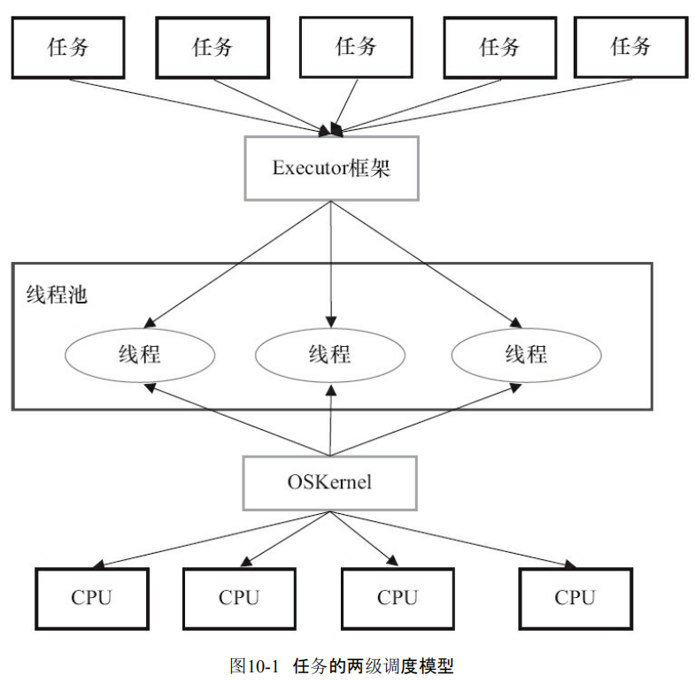
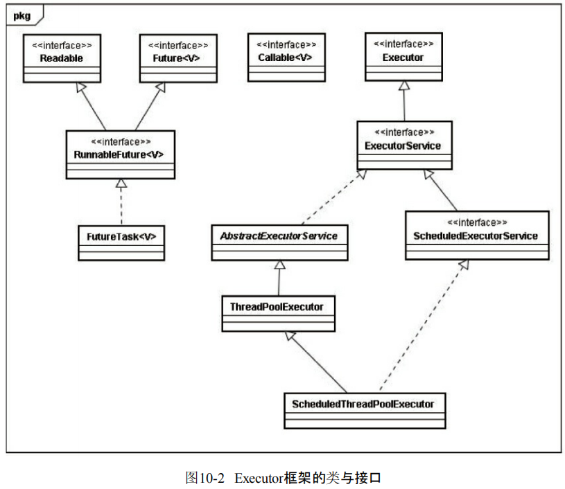
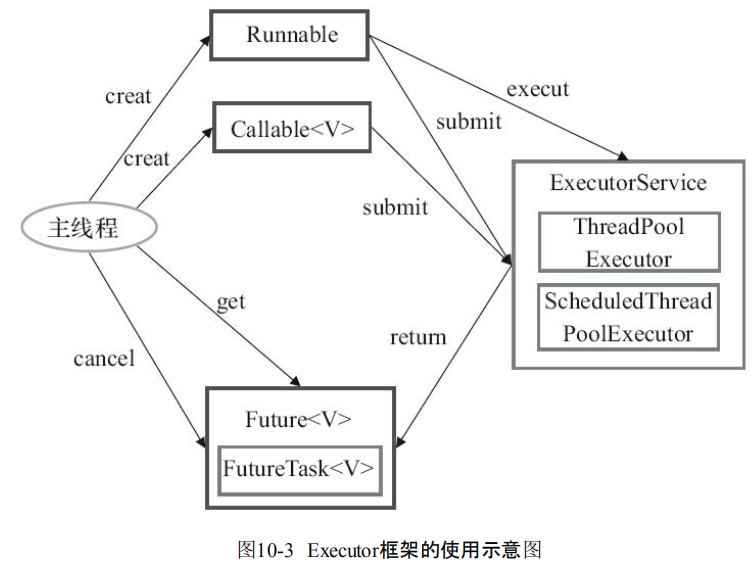

::: tip 说明

线程池ThreadPoolExecutor实现原理

:::

<!-- more -->

[[toc]]

# 线程池ThreadPoolExecutor实现原理

# 1、为什么要使用线程池

在实际使用中，线程是很占用系统资源的，如果对线程管理不善很容易导致系统问题。因此，在大多数并发框架中都会使用**线程池**来管理线程，使用线程池管理线程主要有如下好处：

- 第一：降低资源消耗。通过重复利用已创建的线程降低线程创建和销毁造成的消耗。
- 第二：提高响应速度。当任务到达时，任务可以不需要等到线程创建就能立即执行。
- 第三：提高线程的可管理性。线程是稀缺资源，如果无限制地创建，不仅会消耗系统资源，还会降低系统的稳定性，使用线程池可以进行统一分配、调优和监控。

# 2、Executor框架简介

## 2.1 Executor框架的两级调度模型

在HotSpot VM的线程模型中，Java线程（java.lang.Thread）被一对一映射为本地操作系统线程。Java线程启动时会创建一个本地操作系统线程；当该Java线程终止时，这个操作系统线程也会被回收。操作系统会调度所有线程并将它们分配给可用的CPU。

在上层，Java多线程程序通常把应用分解为若干个任务，然后使用用户级的调度器（Executor框架）将这些任务映射为固定数量的线程；在底层，操作系统内核将这些线程映射到硬件处理器上。这种两级调度模型的示意图如图所示：

 

## 2.2 Executor框架的结构

Executor框架主要由3大部分组成如下。

- **任务**：包括被执行任务需要实现的接口：Runnable接口或Callable接口。
- **任务的执行**：包括任务执行机制的核心接口Executor，以及继承自Executor的ExecutorService接口。Executor框架有两个关键类实现了ExecutorService接口（ThreadPoolExecutor和ScheduledThreadPoolExecutor）。
- **异步计算的结果**：包括接口Future和实现Future接口的FutureTask类。

 

下面是这些类和接口的简介：

- Executor是一个接口，它是Executor框架的基础，它将任务的提交与任务的执行分离开来。
- ThreadPoolExecutor是线程池的核心实现类，用来执行被提交的任务。
- ScheduledThreadPoolExecutor是一个实现类，可以在给定的延迟后运行命令，或者定期执行命令。ScheduledThreadPoolExecutor比Timer更灵活，功能更强大。
- Future接口和实现Future接口的FutureTask类，代表异步计算的结果。
- Runnable接口和Callable接口的实现类，都可以被ThreadPoolExecutor或ScheduledThreadPoolExecutor执行。

 

主线程首先要创建实现Runnable或者Callable接口的任务对象。工具类Executors可以把一个Runnable对象封装为一个Callable对象（Executors.callable（Runnable task）或Executors.callable（Runnable task，Object resule））。

然后可以把Runnable对象直接交给ExecutorService执行（ExecutorService.execute（Runnable command））；或者也可以把Runnable对象或Callable对象提交给ExecutorService执行（ExecutorService.submit（Runnable task）或`ExecutorService.submit(Callable<T> task)`）。

如果执行ExecutorService.submit（…），ExecutorService将返回一个实现Future接口的对象（到目前为止的JDK中，返回的是FutureTask对象）。由于FutureTask实现了Runnable，程序员也可以创建FutureTask，然后直接交给ExecutorService执行。

最后，主线程可以执行FutureTask.get()方法来等待任务执行完成。主线程也可以执行FutureTask.cancel（boolean mayInterruptIfRunning）来取消此任务的执行。

# 3、几个重要的字段

```java
private final AtomicInteger ctl = new AtomicInteger(ctlOf(RUNNING, 0));
private static final int COUNT_BITS = Integer.SIZE - 3;
private static final int CAPACITY   = (1 << COUNT_BITS) - 1;

// runState is stored in the high-order bits
private static final int RUNNING    = -1 << COUNT_BITS;
private static final int SHUTDOWN   =  0 << COUNT_BITS;
private static final int STOP       =  1 << COUNT_BITS;
private static final int TIDYING    =  2 << COUNT_BITS;
private static final int TERMINATED =  3 << COUNT_BITS;
```

`ctl`是对线程池的运行状态和线程池中有效线程的数量进行控制的一个字段， 它包含两部分的信息：线程池的运行状态 (runState) 和线程池内有效线程的数量 (workerCount)，这里可以看到，使用了Integer类型来保存，高3位保存runState，低29位保存workerCount。COUNT_BITS 就是29，CAPACITY就是1左移29位减1（29个1），这个常量表示workerCount的上限值，大约是5亿。

下面再介绍下线程池的运行状态，线程池一共有五种状态, 分别是：

1. **RUNNING** ：能接受新提交的任务，并且也能处理阻塞队列中的任务；
2. **SHUTDOWN**：关闭状态，不再接受新提交的任务，但却可以继续处理阻塞队列中已保存的任务。在线程池处于 RUNNING 状态时，调用 shutdown()方法会使线程池进入到该状态。（finalize() 方法在执行过程中也会调用shutdown()方法进入该状态）；
3. **STOP**：不能接受新任务，也不处理队列中的任务，会中断正在处理任务的线程。在线程池处于 RUNNING 或 SHUTDOWN 状态时，调用 shutdownNow() 方法会使线程池进入到该状态；
4. **TIDYING**：如果所有的任务都已终止了，workerCount (有效线程数) 为0，线程池进入该状态后会调用 terminated() 方法进入TERMINATED 状态。
5. **TERMINATED**：在terminated() 方法执行完后进入该状态，默认terminated()方法中什么也没有做。
   进入TERMINATED的条件如下：
   - 线程池不是RUNNING状态；
   - 线程池状态不是TIDYING状态或TERMINATED状态；
   - 如果线程池状态是SHUTDOWN并且workerQueue为空；
   - workerCount为0；
   - 设置TIDYING状态成功。

下图为线程池的状态转换过程：


# 4、ctl相关方法

这里还有几个对ctl进行计算的方法：

```java
private static int runStateOf(int c)     { return c & ~CAPACITY; }
private static int workerCountOf(int c)  { return c & CAPACITY; }
private static int ctlOf(int rs, int wc) { return rs | wc; }
```

- **runStateOf**：获取运行状态；
- **workerCountOf**：获取活动线程数；
- **ctlOf**：获取运行状态和活动线程数的值。

# 5、ThreadPoolExecutor构造方法

创建线程池主要是**ThreadPoolExecutor**类来完成，ThreadPoolExecutor的有许多重载的构造方法，通过参数最多的构造方法来理解创建线程池有哪些需要配置的参数。ThreadPoolExecutor的构造方法为：

```java
ThreadPoolExecutor(int corePoolSize,
                              int maximumPoolSize,
                              long keepAliveTime,
                              TimeUnit unit,
                              BlockingQueue<Runnable> workQueue,
                              ThreadFactory threadFactory,
                              RejectedExecutionHandler handler)
```

下面对参数进行说明：

1. **corePoolSize**：表示核心线程池的大小。当提交一个任务时，如果当前核心线程池的线程个数没有达到corePoolSize，则会创建新的线程来执行所提交的任务，**即使当前核心线程池有空闲的线程**。如果当前核心线程池的线程个数已经达到了corePoolSize，则不再重新创建线程。如果调用了`prestartCoreThread()`或者 `prestartAllCoreThreads()`，线程池创建的时候所有的核心线程都会被创建并且启动。
2. **maximumPoolSize**：表示线程池能创建线程的最大个数。如果当阻塞队列已满时，并且当前线程池线程个数没有超过maximumPoolSize的话，就会创建新的线程来执行任务。
3. **keepAliveTime**：空闲线程存活时间。如果当前线程池的线程个数已经超过了corePoolSize，并且线程空闲时间超过了keepAliveTime的话，就会将这些空闲线程销毁，这样可以尽可能降低系统资源消耗。
4. **unit**：时间单位。为keepAliveTime指定时间单位。
5. **workQueue**：阻塞队列。用于保存任务的阻塞队列，关于阻塞队列可以看上面的文章。可以使用**ArrayBlockingQueue, LinkedBlockingQueue, SynchronousQueue, PriorityBlockingQueue**。
6. **threadFactory**：创建线程的工程类。可以通过指定线程工厂为每个创建出来的线程设置更有意义的名字，如果出现并发问题，也方便查找问题原因。
7. **handler**：饱和策略。当线程池的阻塞队列已满和指定的线程都已经开启，说明当前线程池已经处于饱和状态了，那么就需要采用一种策略来处理这种情况。采用的策略有这几种：
   1. **AbortPolicy**： 直接拒绝所提交的任务，并抛出**RejectedExecutionException**异常；
   2. **CallerRunsPolicy**：只用调用者所在的线程来执行任务；
   3. **DiscardPolicy**：不处理直接丢弃掉任务；
   4. **DiscardOldestPolicy**：丢弃掉阻塞队列中存放时间最久的任务，执行当前任务。

# 6、execute方法

execute()方法用来提交任务，代码如下：

```java
public void execute(Runnable command) {
    if (command == null)
        throw new NullPointerException();
    /*
     * clt记录着runState和workerCount
     */
    int c = ctl.get();
    /*
     * workerCountOf方法取出低29位的值，表示当前活动的线程数；
     * 如果当前活动线程数小于corePoolSize，则新建一个线程放入线程池中；
     * 并把任务添加到该线程中。
     */
    if (workerCountOf(c) < corePoolSize) {
        /*
         * addWorker中的第二个参数表示限制添加线程的数量是根据corePoolSize来判断还是maximumPoolSize来判断；
         * 如果为true，根据corePoolSize来判断；
         * 如果为false，则根据maximumPoolSize来判断
         */
        if (addWorker(command, true))
            return;
        /*
         * 如果添加失败，则重新获取ctl值
         */
        c = ctl.get();
    }
    /*
     * 如果当前线程池是运行状态并且任务添加到队列成功
     */
    if (isRunning(c) && workQueue.offer(command)) {
        // 重新获取ctl值
        int recheck = ctl.get();
        // 再次判断线程池的运行状态，如果不是运行状态，由于之前已经把command添加到workQueue中了，
        // 这时需要移除该command
        // 执行过后通过handler使用拒绝策略对该任务进行处理，整个方法返回
        if (! isRunning(recheck) && remove(command))
            reject(command);
        /*
         * 获取线程池中的有效线程数，如果数量是0，则执行addWorker方法
         * 这里传入的参数表示：
         * 1. 第一个参数为null，表示在线程池中创建一个线程，但不去启动；
         * 2. 第二个参数为false，将线程池的有限线程数量的上限设置为maximumPoolSize，添加线程时根据maximumPoolSize来判断；
         * 如果判断workerCount大于0，则直接返回，在workQueue中新增的command会在将来的某个时刻被执行。
         */
        else if (workerCountOf(recheck) == 0)
            addWorker(null, false);
    }
    /*
     * 如果执行到这里，有两种情况：
     * 1. 线程池已经不是RUNNING状态；
     * 2. 线程池是RUNNING状态，但workerCount >= corePoolSize并且workQueue已满。
     * 这时，再次调用addWorker方法，但第二个参数传入为false，将线程池的有限线程数量的上限设置为maximumPoolSize；
     * 如果失败则拒绝该任务
     */
    else if (!addWorker(command, false))
        reject(command);
}
```

简单来说，在执行execute()方法时如果状态一直是RUNNING时，的执行过程如下：

1. 如果`workerCount < corePoolSize`，则创建并启动一个线程来执行新提交的任务；
2. 如果`workerCount >= corePoolSize`，且线程池内的阻塞队列未满，则将任务添加到该阻塞队列中；
3. 如果`workerCount >= corePoolSize && workerCount < maximumPoolSize`，且线程池内的阻塞队列已满，则创建并启动一个线程来执行新提交的任务；
4. 如果`workerCount >= maximumPoolSize`，并且线程池内的阻塞队列已满，则根据拒绝策略来处理该任务，默认的处理方式是直接抛异常。

这里要注意一下`addWorker(null, false);`，也就是创建一个线程，但并没有传入任务，因为任务已经被添加到workQueue中了，所以worker在执行的时候，会直接从workQueue中获取任务。所以，在`workerCountOf(recheck) == 0`时执行`addWorker(null, false);`也是为了保证线程池在RUNNING状态下必须要有一个线程来执行任务。

execute方法执行流程如下：

 

线程池的设计思想就是使用了**核心线程池corePoolSize，阻塞队列workQueue和线程池maximumPoolSize**，这样的缓存策略来处理任务，实际上这样的设计思想在需要框架中都会使用。

# 7、addWorker方法

addWorker方法的主要工作是在线程池中创建一个新的线程并执行，firstTask参数 用于指定新增的线程执行的第一个任务，core参数为true表示在新增线程时会判断当前活动线程数是否少于corePoolSize，false表示新增线程前需要判断当前活动线程数是否少于maximumPoolSize，代码如下：

```java
private boolean addWorker(Runnable firstTask, boolean core) {
    retry:
    for (;;) {
        int c = ctl.get();
        // 获取运行状态
        int rs = runStateOf(c);

        /*
         * 这个if判断
         * 如果rs >= SHUTDOWN，则表示此时不再接收新任务；
         * 接着判断以下3个条件，只要有1个不满足，则返回false：
         * 1. rs == SHUTDOWN，这时表示关闭状态，不再接受新提交的任务，但却可以继续处理阻塞队列中已保存的任务
         * 2. firsTask为空
         * 3. 阻塞队列不为空
         *
         * 首先考虑rs == SHUTDOWN的情况
         * 这种情况下不会接受新提交的任务，所以在firstTask不为空的时候会返回false；
         * 然后，如果firstTask为空，并且workQueue也为空，则返回false，
         * 因为队列中已经没有任务了，不需要再添加线程了
         */
        // Check if queue empty only if necessary.
        if (rs >= SHUTDOWN &&
            ! (rs == SHUTDOWN &&
               firstTask == null &&
               ! workQueue.isEmpty()))
            return false;

        for (;;) {
            // 获取线程数
            int wc = workerCountOf(c);
            // 如果wc超过CAPACITY，也就是ctl的低29位的最大值（二进制是29个1），返回false；
            // 这里的core是addWorker方法的第二个参数，如果为true表示根据corePoolSize来比较，
            // 如果为false则根据maximumPoolSize来比较。
            if (wc >= CAPACITY ||
                wc >= (core ? corePoolSize : maximumPoolSize))
                return false;
            // 尝试增加workerCount，如果成功，则跳出第一个for循环
            if (compareAndIncrementWorkerCount(c))
                break retry;
            // 如果增加workerCount失败，则重新获取ctl的值
            c = ctl.get();  // Re-read ctl
            // 如果当前的运行状态不等于rs，说明状态已被改变，返回第一个for循环继续执行
            if (runStateOf(c) != rs)
                continue retry;
            // else CAS failed due to workerCount change; retry inner loop
        }
    }

    boolean workerStarted = false;
    boolean workerAdded = false;
    Worker w = null;
    try {
        // 根据firstTask来创建Worker对象
        w = new Worker(firstTask);
        // 每一个Worker对象都会创建一个线程
        final Thread t = w.thread;
        if (t != null) {
            final ReentrantLock mainLock = this.mainLock;
            mainLock.lock();
            try {
                // Recheck while holding lock.
                // Back out on ThreadFactory failure or if
                // shut down before lock acquired.
                int rs = runStateOf(ctl.get());
                // rs < SHUTDOWN表示是RUNNING状态；
                // 如果rs是RUNNING状态或者rs是SHUTDOWN状态并且firstTask为null，向线程池中添加线程。
                // 因为在SHUTDOWN时不会在添加新的任务，但还是会执行workQueue中的任务
                if (rs < SHUTDOWN ||
                    (rs == SHUTDOWN && firstTask == null)) {
                    if (t.isAlive()) // precheck that t is startable
                        throw new IllegalThreadStateException();
                    // workers是一个HashSet
                    workers.add(w);
                    int s = workers.size();
                    // largestPoolSize记录着线程池中出现过的最大线程数量
                    if (s > largestPoolSize)
                        largestPoolSize = s;
                    workerAdded = true;
                }
            } finally {
                mainLock.unlock();
            }
            if (workerAdded) {
                // 启动线程
                t.start();
                workerStarted = true;
            }
        }
    } finally {
        if (! workerStarted)
            addWorkerFailed(w);
    }
    return workerStarted;
}
```

注意一下这里的`t.start()`这个语句，启动时会调用Worker类中的run方法，Worker本身实现了Runnable接口，所以一个Worker类型的对象也是一个线程。

# 8、Worker类

线程池中的每一个线程被封装成一个Worker对象，ThreadPool维护的其实就是一组Worker对象，看一下Worker的定义：

```java
private final class Worker
        extends AbstractQueuedSynchronizer
        implements Runnable
{
    /**
     * This class will never be serialized, but we provide a
     * serialVersionUID to suppress a javac warning.
     */
    private static final long serialVersionUID = 6138294804551838833L;

    /** Thread this worker is running in.  Null if factory fails. */
    final Thread thread;
    /** Initial task to run.  Possibly null. */
    Runnable firstTask;
    /** Per-thread task counter */
    volatile long completedTasks;

    /**
     * Creates with given first task and thread from ThreadFactory.
     * @param firstTask the first task (null if none)
     */
    Worker(Runnable firstTask) {
        setState(-1); // inhibit interrupts until runWorker
        this.firstTask = firstTask;
        this.thread = getThreadFactory().newThread(this);
    }

    /** Delegates main run loop to outer runWorker  */
    public void run() {
        runWorker(this);
    }

    // Lock methods
    //
    // The value 0 represents the unlocked state.
    // The value 1 represents the locked state.

    protected boolean isHeldExclusively() {
        return getState() != 0;
    }

    protected boolean tryAcquire(int unused) {
        if (compareAndSetState(0, 1)) {
            setExclusiveOwnerThread(Thread.currentThread());
            return true;
        }
        return false;
    }

    protected boolean tryRelease(int unused) {
        setExclusiveOwnerThread(null);
        setState(0);
        return true;
    }

    public void lock()        { acquire(1); }
    public boolean tryLock()  { return tryAcquire(1); }
    public void unlock()      { release(1); }
    public boolean isLocked() { return isHeldExclusively(); }

    void interruptIfStarted() {
        Thread t;
        if (getState() >= 0 && (t = thread) != null && !t.isInterrupted()) {
            try {
                t.interrupt();
            } catch (SecurityException ignore) {
            }
        }
    }
}
```

Worker类继承了AQS，并实现了Runnable接口，注意其中的firstTask和thread属性：firstTask用它来保存传入的任务；thread是在调用构造方法时通过ThreadFactory来创建的线程，是用来处理任务的线程。

在调用构造方法时，需要把任务传入，这里通过`getThreadFactory().newThread(this);`来新建一个线程，newThread方法传入的参数是this，因为Worker本身继承了Runnable接口，也就是一个线程，所以一个Worker对象在启动的时候会调用Worker类中的run方法。

Worker继承了AQS，使用AQS来实现独占锁的功能。为什么不使用ReentrantLock来实现呢？可以看到tryAcquire方法，它是不允许重入的，而ReentrantLock是允许重入的：

1. lock方法一旦获取了独占锁，表示当前线程正在执行任务中；
2. 如果正在执行任务，则不应该中断线程；
3. 如果该线程现在不是独占锁的状态，也就是空闲的状态，说明它没有在处理任务，这时可以对该线程进行中断；
4. 线程池在执行shutdown方法或tryTerminate方法时会调用interruptIdleWorkers方法来中断空闲的线程，interruptIdleWorkers方法会使用tryLock方法来判断线程池中的线程是否是空闲状态；
5. 之所以设置为不可重入，是因为我们不希望任务在调用像setCorePoolSize这样的线程池控制方法时重新获取锁。如果使用ReentrantLock，它是可重入的，这样如果在任务中调用了如setCorePoolSize这类线程池控制的方法，会中断正在运行的线程。

所以，Worker继承自AQS，用于判断线程是否空闲以及是否可以被中断。

此外，在构造方法中执行了`setState(-1);`，把state变量设置为-1，为什么这么做呢？是因为AQS中默认的state是0，如果刚创建了一个Worker对象，还没有执行任务时，这时就不应该被中断，看一下tryAquire方法：

```java
protected boolean tryAcquire(int unused) {
    if (compareAndSetState(0, 1)) {
        setExclusiveOwnerThread(Thread.currentThread());
        return true;
    }
    return false;
}
```

tryAcquire方法是根据state是否是0来判断的，所以，`setState(-1);`将state设置为-1是为了禁止在执行任务前对线程进行中断。

正因为如此，在runWorker方法中会先调用Worker对象的unlock方法将state设置为0。

# 9、runWorker方法

在Worker类中的run方法调用了ThreadPoolExecutor的runWorker方法来执行任务，runWorker方法的代码如下：

```java
final void runWorker(Worker w) {
    Thread wt = Thread.currentThread();
    // 获取第一个任务
    Runnable task = w.firstTask;
    w.firstTask = null;
    // 允许中断
    w.unlock(); // allow interrupts
    // 是否因为异常退出循环
    boolean completedAbruptly = true;
    try {
        // 如果task为空，则通过getTask来获取任务
        while (task != null || (task = getTask()) != null) {
            w.lock();
            // If pool is stopping, ensure thread is interrupted;
            // if not, ensure thread is not interrupted.  This
            // requires a recheck in second case to deal with
            // shutdownNow race while clearing interrupt
            if ((runStateAtLeast(ctl.get(), STOP) ||
                 (Thread.interrupted() &&
                  runStateAtLeast(ctl.get(), STOP))) &&
                !wt.isInterrupted())
                wt.interrupt();
            try {
                beforeExecute(wt, task);
                Throwable thrown = null;
                try {
                    task.run();
                } catch (RuntimeException x) {
                    thrown = x; throw x;
                } catch (Error x) {
                    thrown = x; throw x;
                } catch (Throwable x) {
                    thrown = x; throw new Error(x);
                } finally {
                    afterExecute(task, thrown);
                }
            } finally {
                task = null;
                w.completedTasks++;
                w.unlock();
            }
        }
        completedAbruptly = false;
    } finally {
        processWorkerExit(w, completedAbruptly);
    }
}
```

这里说明一下第一个if判断，目的是：

- 如果线程池正在停止，那么要保证当前线程是中断状态；
- 如果不是的话，则要保证当前线程不是中断状态；

这里要考虑在执行该if语句期间可能也执行了shutdownNow方法，shutdownNow方法会把状态设置为STOP，回顾一下STOP状态：

> 不能接受新任务，也不处理队列中的任务，会中断正在处理任务的线程。在线程池处于 RUNNING 或 SHUTDOWN 状态时，调用 shutdownNow() 方法会使线程池进入到该状态。

STOP状态要中断线程池中的所有线程，而这里使用`Thread.interrupted()`来判断是否中断是为了确保在RUNNING或者SHUTDOWN状态时线程是非中断状态的，因为Thread.interrupted()方法会复位中断的状态。

总结一下runWorker方法的执行过程：

1. while循环不断地通过getTask()方法获取任务；
2. getTask()方法从阻塞队列中取任务；
3. 如果线程池正在停止，那么要保证当前线程是中断状态，否则要保证当前线程不是中断状态；
4. 调用`task.run()`执行任务；
5. 如果task为null则跳出循环，执行processWorkerExit()方法；
6. runWorker方法执行完毕，也代表着Worker中的run方法执行完毕，销毁线程。

这里的beforeExecute方法和afterExecute方法在ThreadPoolExecutor类中是空的，留给子类来实现。

completedAbruptly变量来表示在执行任务过程中是否出现了异常，在processWorkerExit方法中会对该变量的值进行判断。

# 10、getTask方法

getTask方法用来从阻塞队列中取任务，代码如下：

```java
private Runnable getTask() {
    // timeOut变量的值表示上次从阻塞队列中取任务时是否超时
    boolean timedOut = false; // Did the last poll() time out?

    for (;;) {
        int c = ctl.get();
        int rs = runStateOf(c);

        // Check if queue empty only if necessary.
        /*
         * 如果线程池状态rs >= SHUTDOWN，也就是非RUNNING状态，再进行以下判断：
         * 1. rs >= STOP，线程池是否正在stop；
         * 2. 阻塞队列是否为空。
         * 如果以上条件满足，则将workerCount减1并返回null。
         * 因为如果当前线程池状态的值是SHUTDOWN或以上时，不允许再向阻塞队列中添加任务。
         */
        if (rs >= SHUTDOWN && (rs >= STOP || workQueue.isEmpty())) {
            decrementWorkerCount();
            return null;
        }

        int wc = workerCountOf(c);

        // Are workers subject to culling?
        // timed变量用于判断是否需要进行超时控制。
        // allowCoreThreadTimeOut默认是false，也就是核心线程不允许进行超时；
        // wc > corePoolSize，表示当前线程池中的线程数量大于核心线程数量；
        // 对于超过核心线程数量的这些线程，需要进行超时控制
        boolean timed = allowCoreThreadTimeOut || wc > corePoolSize;

        /*
         * wc > maximumPoolSize的情况是因为可能在此方法执行阶段同时执行了setMaximumPoolSize方法；
         * timed && timedOut 如果为true，表示当前操作需要进行超时控制，并且上次从阻塞队列中获取任务发生了超时
         * 接下来判断，如果有效线程数量大于1，或者阻塞队列是空的，那么尝试将workerCount减1；
         * 如果减1失败，则返回重试。
         * 如果wc == 1时，也就说明当前线程是线程池中唯一的一个线程了。
         */
        if ((wc > maximumPoolSize || (timed && timedOut))
            && (wc > 1 || workQueue.isEmpty())) {
            if (compareAndDecrementWorkerCount(c))
                return null;
            continue;
        }

        try {
            /*
             * 根据timed来判断，如果为true，则通过阻塞队列的poll方法进行超时控制，如果在keepAliveTime时间内没有获取到任务，则返回null；
             * 否则通过take方法，如果这时队列为空，则take方法会阻塞直到队列不为空。
             *
             */
            Runnable r = timed ?
                workQueue.poll(keepAliveTime, TimeUnit.NANOSECONDS) :
                workQueue.take();
            if (r != null)
                return r;
            // 如果 r == null，说明已经超时，timedOut设置为true
            timedOut = true;
        } catch (InterruptedException retry) {
            // 如果获取任务时当前线程发生了中断，则设置timedOut为false并返回循环重试
            timedOut = false;
        }
    }
}
```

这里重要的地方是第二个if判断，目的是控制线程池的有效线程数量。由上文中的分析可以知道，在执行execute方法时，如果当前线程池的线程数量超过了corePoolSize且小于maximumPoolSize，并且workQueue已满时，则可以增加工作线程，但这时如果超时没有获取到任务，也就是timedOut为true的情况，说明workQueue已经为空了，也就说明了当前线程池中不需要那么多线程来执行任务了，可以把多于corePoolSize数量的线程销毁掉，保持线程数量在corePoolSize即可。

什么时候会销毁？当然是runWorker方法执行完之后，也就是Worker中的run方法执行完，由JVM自动回收。

getTask方法返回null时，在runWorker方法中会跳出while循环，然后会执行processWorkerExit方法。

# 11、processWorkerExit方法

```java
private void processWorkerExit(Worker w, boolean completedAbruptly) {
    // 如果completedAbruptly值为true，则说明线程执行时出现了异常，需要将workerCount减1；
    // 如果线程执行时没有出现异常，说明在getTask()方法中已经已经对workerCount进行了减1操作，这里就不必再减了。
    if (completedAbruptly) // If abrupt, then workerCount wasn't adjusted
        decrementWorkerCount();

    final ReentrantLock mainLock = this.mainLock;
    mainLock.lock();
    try {
        //统计完成的任务数
        completedTaskCount += w.completedTasks;
        // 从workers中移除，也就表示着从线程池中移除了一个工作线程
        workers.remove(w);
    } finally {
        mainLock.unlock();
    }

    // 根据线程池状态进行判断是否结束线程池
    tryTerminate();

    int c = ctl.get();
    /*
     * 当线程池是RUNNING或SHUTDOWN状态时，如果worker是异常结束，那么会直接addWorker；
     * 如果allowCoreThreadTimeOut=true，并且等待队列有任务，至少保留一个worker；
     * 如果allowCoreThreadTimeOut=false，workerCount不少于corePoolSize。
     */
    if (runStateLessThan(c, STOP)) {
        if (!completedAbruptly) {
            int min = allowCoreThreadTimeOut ? 0 : corePoolSize;
            if (min == 0 && ! workQueue.isEmpty())
                min = 1;
            if (workerCountOf(c) >= min)
                return; // replacement not needed
        }
        addWorker(null, false);
    }
}
```

至此，processWorkerExit执行完之后，工作线程被销毁，以上就是整个工作线程的生命周期，从execute方法开始，Worker使用ThreadFactory创建新的工作线程，runWorker通过getTask获取任务，然后执行任务，如果getTask返回null，进入processWorkerExit方法，整个线程结束，如图所示：

 

# 12、tryTerminate方法

tryTerminate方法根据线程池状态进行判断是否结束线程池，代码如下：

```java
final void tryTerminate() {
    for (;;) {
        int c = ctl.get();
        /*
         * 当前线程池的状态为以下几种情况时，直接返回：
         * 1. RUNNING，因为还在运行中，不能停止；
         * 2. TIDYING或TERMINATED，因为线程池中已经没有正在运行的线程了；
         * 3. SHUTDOWN并且等待队列非空，这时要执行完workQueue中的task；
         */
        if (isRunning(c) ||
            runStateAtLeast(c, TIDYING) ||
            (runStateOf(c) == SHUTDOWN && ! workQueue.isEmpty()))
            return;
        // 如果线程数量不为0，则中断一个空闲的工作线程，并返回
        if (workerCountOf(c) != 0) { // Eligible to terminate
            interruptIdleWorkers(ONLY_ONE);
            return;
        }

        final ReentrantLock mainLock = this.mainLock;
        mainLock.lock();
        try {
            // 这里尝试设置状态为TIDYING，如果设置成功，则调用terminated方法
            if (ctl.compareAndSet(c, ctlOf(TIDYING, 0))) {
                try {
                    // terminated方法默认什么都不做，留给子类实现
                    terminated();
                } finally {
                    // 设置状态为TERMINATED
                    ctl.set(ctlOf(TERMINATED, 0));
                    termination.signalAll();
                }
                return;
            }
        } finally {
            mainLock.unlock();
        }
        // else retry on failed CAS
    }
}
```

`interruptIdleWorkers(ONLY_ONE);`的作用是因为在getTask方法中执行`workQueue.take()`时，如果不执行中断会一直阻塞。在下面介绍的shutdown方法中，会中断所有空闲的工作线程，如果在执行shutdown时工作线程没有空闲，然后又去调用了getTask方法，这时如果workQueue中没有任务了，调用`workQueue.take()`时就会一直阻塞。所以每次在工作线程结束时调用tryTerminate方法来尝试中断一个空闲工作线程，避免在队列为空时取任务一直阻塞的情况。

# 13、shutdown方法

关闭线程池，可以通过`shutdown`和`shutdownNow`这两个方法。它们的原理都是遍历线程池中所有的线程，然后依次中断线程。`shutdown`和`shutdownNow`还是有不一样的地方：

1. `shutdownNow`首先将线程池的状态设置为**STOP**，然后尝试**停止所有的正在执行和未执行任务**的线程，并返回等待执行任务的列表；
2. `shutdown`只是将线程池的状态设置为**SHUTDOWN**状态，然后中断所有没有正在执行任务的线程

可以看出shutdown方法会将正在执行的任务继续执行完，而shutdownNow会直接中断正在执行的任务。调用了这两个方法的任意一个，`isShutdown`方法都会返回true，当所有的线程都关闭成功，才表示线程池成功关闭，这时调用`isTerminated`方法才会返回true。

shutdown方法要将线程池切换到SHUTDOWN状态，并调用interruptIdleWorkers方法请求中断所有空闲的worker，最后调用tryTerminate尝试结束线程池。

```java
public void shutdown() {
    final ReentrantLock mainLock = this.mainLock;
    mainLock.lock();
    try {
        // 安全策略判断
        checkShutdownAccess();
        // 切换状态为SHUTDOWN
        advanceRunState(SHUTDOWN);
        // 中断空闲线程
        interruptIdleWorkers();
        onShutdown(); // hook for ScheduledThreadPoolExecutor
    } finally {
        mainLock.unlock();
    }
    // 尝试结束线程池
    tryTerminate();
}
```

这里思考一个问题：在runWorker方法中，执行任务时对Worker对象w进行了lock操作，为什么要在执行任务的时候对每个工作线程都加锁呢？

下面仔细分析一下：

- 在getTask方法中，如果这时线程池的状态是SHUTDOWN并且workQueue为空，那么就应该返回null来结束这个工作线程，而使线程池进入SHUTDOWN状态需要调用shutdown方法；
- shutdown方法会调用interruptIdleWorkers来中断空闲的线程，interruptIdleWorkers持有mainLock，会遍历workers来逐个判断工作线程是否空闲。但getTask方法中没有mainLock；
- 在getTask中，如果判断当前线程池状态是RUNNING，并且阻塞队列为空，那么会调用`workQueue.take()`进行阻塞；
- 如果在判断当前线程池状态是RUNNING后，这时调用了shutdown方法把状态改为了SHUTDOWN，这时如果不进行中断，那么当前的工作线程在调用了`workQueue.take()`后会一直阻塞而不会被销毁，因为在SHUTDOWN状态下不允许再有新的任务添加到workQueue中，这样一来线程池永远都关闭不了了；
- 由上可知，shutdown方法与getTask方法（从队列中获取任务时）存在竞态条件；
- 解决这一问题就需要用到线程的中断，也就是为什么要用interruptIdleWorkers方法。在调用`workQueue.take()`时，如果发现当前线程在执行之前或者执行期间是中断状态，则会抛出InterruptedException，解除阻塞的状态；
- 但是要中断工作线程，还要判断工作线程是否是空闲的，如果工作线程正在处理任务，就不应该发生中断；
- 所以Worker继承自AQS，在工作线程处理任务时会进行lock，interruptIdleWorkers在进行中断时会使用tryLock来判断该工作线程是否正在处理任务，如果tryLock返回true，说明该工作线程当前未执行任务，这时才可以被中断。

下面就来分析一下interruptIdleWorkers方法。

# 14、interruptIdleWorkers方法

```java
private void interruptIdleWorkers() {
    interruptIdleWorkers(false);
}

private void interruptIdleWorkers(boolean onlyOne) {
    final ReentrantLock mainLock = this.mainLock;
    mainLock.lock();
    try {
        for (Worker w : workers) {
            Thread t = w.thread;
            if (!t.isInterrupted() && w.tryLock()) {
                try {
                    t.interrupt();
                } catch (SecurityException ignore) {
                } finally {
                    w.unlock();
                }
            }
            if (onlyOne)
                break;
        }
    } finally {
        mainLock.unlock();
    }
}
```

interruptIdleWorkers遍历workers中所有的工作线程，若线程没有被中断tryLock成功，就中断该线程。

为什么需要持有mainLock？因为workers是HashSet类型的，不能保证线程安全。

# 15、shutdownNow方法

```java
public List<Runnable> shutdownNow() {
    List<Runnable> tasks;
    final ReentrantLock mainLock = this.mainLock;
    mainLock.lock();
    try {
        checkShutdownAccess();
        advanceRunState(STOP);
        // 中断所有工作线程，无论是否空闲
        interruptWorkers();
        // 取出队列中没有被执行的任务
        tasks = drainQueue();
    } finally {
        mainLock.unlock();
    }
    tryTerminate();
    return tasks;
}
```

shutdownNow方法与shutdown方法类似，不同的地方在于：

1. 设置状态为STOP；
2. 中断所有工作线程，无论是否是空闲的；
3. 取出阻塞队列中没有被执行的任务并返回。

shutdownNow方法执行完之后调用tryTerminate方法，该方法在上文已经分析过了，目的就是使线程池的状态设置为TERMINATED。

# 16、线程池的监控

通过线程池提供的参数进行监控。线程池里有一些属性在监控线程池的时候可以使用：

- **getTaskCount**：线程池已经执行的和未执行的任务总数；
- **getCompletedTaskCount**：线程池已完成的任务数量，该值小于等于taskCount；
- **getLargestPoolSize**：线程池曾经创建过的最大线程数量。通过这个数据可以知道线程池是否满过，也就是达到了maximumPoolSize；
- **getPoolSize**：线程池当前的线程数量；
- **getActiveCount**：当前线程池中正在执行任务的线程数量。

通过这些方法，可以对线程池进行监控，在ThreadPoolExecutor类中提供了几个空方法，如beforeExecute方法，afterExecute方法和terminated方法，可以扩展这些方法在执行前或执行后增加一些新的操作，例如统计线程池的执行任务的时间等，可以继承自ThreadPoolExecutor来进行扩展。

# 17、如何合理配置线程池参数？

要想合理的配置线程池，就必须首先分析任务特性，可以从以下几个角度来进行分析：

1. 任务的性质：CPU密集型任务，IO密集型任务和混合型任务。
2. 任务的优先级：高，中和低。
3. 任务的执行时间：长，中和短。
4. 任务的依赖性：是否依赖其他系统资源，如数据库连接。

任务性质不同的任务可以用不同规模的线程池分开处理。CPU密集型任务配置尽可能少的线程数量，如配置**Ncpu+1**个线程的线程池。IO密集型任务则由于需要等待IO操作，线程并不是一直在执行任务，则配置尽可能多的线程，如**2xNcpu**。混合型的任务，如果可以拆分，则将其拆分成一个CPU密集型任务和一个IO密集型任务，只要这两个任务执行的时间相差不是太大，那么分解后执行的吞吐率要高于串行执行的吞吐率，如果这两个任务执行时间相差太大，则没必要进行分解。我们可以通过`Runtime.getRuntime().availableProcessors()`方法获得当前设备的CPU个数。

优先级不同的任务可以使用优先级队列PriorityBlockingQueue来处理。它可以让优先级高的任务先得到执行，需要注意的是如果一直有优先级高的任务提交到队列里，那么优先级低的任务可能永远不能执行。

执行时间不同的任务可以交给不同规模的线程池来处理，或者也可以使用优先级队列，让执行时间短的任务先执行。

依赖数据库连接池的任务，因为线程提交SQL后需要等待数据库返回结果，如果等待的时间越长CPU空闲时间就越长，那么线程数应该设置越大，这样才能更好的利用CPU。

并且，阻塞队列**最好是使用有界队列**，如果采用无界队列的话，一旦任务积压在阻塞队列中的话就会占用过多的内存资源，甚至会使得系统崩溃。

> 参考文献

《Java并发编程的艺术》

[深入理解Java线程池：ThreadPoolExecutor](http://www.ideabuffer.cn/2017/04/04/%E6%B7%B1%E5%85%A5%E7%90%86%E8%A7%A3Java%E7%BA%BF%E7%A8%8B%E6%B1%A0%EF%BC%9AThreadPoolExecutor/)

