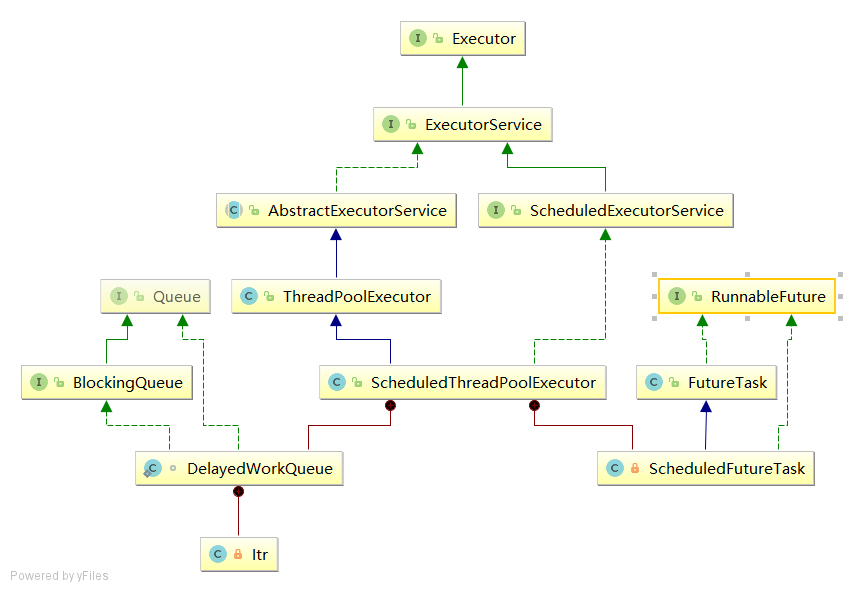

::: tip 说明

线程池之ScheduledThreadPoolExecutor

:::

<!-- more -->

[[toc]]

# 线程池之ScheduledThreadPoolExecutor

# 1、ScheduledThreadPoolExecutor简介

ScheduledThreadPoolExecutor可以用来在给定延时后执行异步任务或者周期性执行任务，相对于任务调度的Timer来说，其功能更加强大，Timer只能使用一个后台线程执行任务，而ScheduledThreadPoolExecutor则可以通过构造函数来指定后台线程的个数。ScheduledThreadPoolExecutor类的UML图如下：

 

1. 从UML图可以看出，ScheduledThreadPoolExecutor继承了`ThreadPoolExecutor`，也就是说ScheduledThreadPoolExecutor拥有execute()和submit()提交异步任务的基础功能，关于ThreadPoolExecutor可以看上面的文章。但是，ScheduledThreadPoolExecutor类实现了`ScheduledExecutorService`，该接口定义了ScheduledThreadPoolExecutor能够延时执行任务和周期执行任务的功能；
2. ScheduledThreadPoolExecutor也两个重要的内部类：**DelayedWorkQueue**和**ScheduledFutureTask**。可以看出DelayedWorkQueue实现了BlockingQueue接口，也就是一个阻塞队列，ScheduledFutureTask则是继承了FutureTask类，也表示该类用于返回异步任务的结果。这两个关键类，下面会具体详细来看。

## 1.1 构造方法

ScheduledThreadPoolExecutor有如下几个构造方法：

```java
public ScheduledThreadPoolExecutor(int corePoolSize) {
    super(corePoolSize, Integer.MAX_VALUE, 0, NANOSECONDS,
          new DelayedWorkQueue());
}；

public ScheduledThreadPoolExecutor(int corePoolSize,
                                   ThreadFactory threadFactory) {
    super(corePoolSize, Integer.MAX_VALUE, 0, NANOSECONDS,
          new DelayedWorkQueue(), threadFactory);
}；
public ScheduledThreadPoolExecutor(int corePoolSize,
                                   RejectedExecutionHandler handler) {
    super(corePoolSize, Integer.MAX_VALUE, 0, NANOSECONDS,
          new DelayedWorkQueue(), handler);
}；

public ScheduledThreadPoolExecutor(int corePoolSize,
                                   ThreadFactory threadFactory,
                                   RejectedExecutionHandler handler) {
    super(corePoolSize, Integer.MAX_VALUE, 0, NANOSECONDS,
          new DelayedWorkQueue(), threadFactory, handler);
}
```

可以看出由于ScheduledThreadPoolExecutor继承了ThreadPoolExecutor，它的构造方法实际上是调用了ThreadPoolExecutor，理解ThreadPoolExecutor构造方法的几个参数的意义后，理解这就很容易了。可以看出，ScheduledThreadPoolExecutor的核心线程池的线程个数为指定的corePoolSize，当核心线程池的线程个数达到corePoolSize后，就会将任务提交给有界阻塞队列DelayedWorkQueue，对DelayedWorkQueue在下面进行详细介绍，线程池允许最大的线程个数为Integer.MAX_VALUE，也就是说理论上这是一个大小无界的线程池。

## 1.2 特有方法

ScheduledThreadPoolExecutor实现了`ScheduledExecutorService`接口，该接口定义了**可延时执行异步任务和可周期执行异步任务的特有功能**，相应的方法分别为：

```java
//达到给定的延时时间后，执行任务。这里传入的是实现Runnable接口的任务，
//因此通过ScheduledFuture.get()获取结果为null
public ScheduledFuture<?> schedule(Runnable command,
                                       long delay, TimeUnit unit);
//达到给定的延时时间后，执行任务。这里传入的是实现Callable接口的任务，
//因此，返回的是任务的最终计算结果
 public <V> ScheduledFuture<V> schedule(Callable<V> callable,
                                           long delay, TimeUnit unit);

//是以上一个任务开始的时间计时，period时间过去后，
//检测上一个任务是否执行完毕，如果上一个任务执行完毕，
//则当前任务立即执行，如果上一个任务没有执行完毕，则需要等上一个任务执行完毕后立即执行
public ScheduledFuture<?> scheduleAtFixedRate(Runnable command,
                                                  long initialDelay,
                                                  long period,
                                                  TimeUnit unit);
//当达到延时时间initialDelay后，任务开始执行。上一个任务执行结束后到下一次
//任务执行，中间延时时间间隔为delay。以这种方式，周期性执行任务。
public ScheduledFuture<?> scheduleWithFixedDelay(Runnable command,
                                                     long initialDelay,
                                                     long delay,
                                                     TimeUnit unit);
```

# 2、ScheduledFutureTask

ScheduledThreadPoolExecutor（可周期性执行的任务）最大的特色是能够周期性执行异步任务，当调用`schedule`，`scheduleAtFixedRate`和`scheduleWithFixedDelay`方法时，实际上是将提交的任务转换成的ScheduledFutureTask类，从源码就可以看出。以schedule方法为例：

```java
public ScheduledFuture<?> schedule(Runnable command,
                                   long delay,
                                   TimeUnit unit) {
    if (command == null || unit == null)
        throw new NullPointerException();
    RunnableScheduledFuture<?> t = decorateTask(command,
        new ScheduledFutureTask<Void>(command, null,
                                      triggerTime(delay, unit)));
    delayedExecute(t);
    return t;
}
```

可以看出，通过`decorateTask`会将传入的Runnable转换成`ScheduledFutureTask`类。线程池最大作用是将任务和线程进行解耦，线程主要是任务的执行者，而任务也就是现在所说的ScheduledFutureTask。紧接着，会想到任何线程执行任务，总会调用`run()`方法。为了保证ScheduledThreadPoolExecutor能够延时执行任务以及能够周期性执行任务，ScheduledFutureTask重写了run方法：

```java
public void run() {
    boolean periodic = isPeriodic();
    if (!canRunInCurrentRunState(periodic))
        cancel(false);
    else if (!periodic)
		//如果不是周期性执行任务，则直接调用run方法
        ScheduledFutureTask.super.run();
		//如果是周期性执行任务的话，需要重设下一次执行任务的时间
    else if (ScheduledFutureTask.super.runAndReset()) {
        setNextRunTime();
        reExecutePeriodic(outerTask);
    }
}
```

从源码可以很明显的看出，在重写的run方法中会先`if (!periodic)`判断当前任务是否是周期性任务，如果不是的话就直接调用`run()`方法；否则的话执行`setNextRunTime()`方法重设下一次任务执行的时间，并通过`reExecutePeriodic(outerTask)`方法将下一次待执行的任务放置到`DelayedWorkQueue`中。

因此，可以得出结论：**`ScheduledFutureTask`最主要的功能是根据当前任务是否具有周期性，对异步任务进行进一步封装。如果不是周期性任务（调用schedule方法）则直接通过`run()`执行，若是周期性任务，则需要在每一次执行完后，重设下一次执行的时间，然后将下一次任务继续放入到阻塞队列中。**

# 3、DelayedWorkQueue

在ScheduledThreadPoolExecutor中还有另外的一个重要的类就是DelayedWorkQueue。为了实现其ScheduledThreadPoolExecutor能够延时执行异步任务以及能够周期执行任务，DelayedWorkQueue进行相应的封装。DelayedWorkQueue是一个基于堆的数据结构，类似于DelayQueue和PriorityQueue。在执行定时任务的时候，每个任务的执行时间都不同，所以DelayedWorkQueue的工作就是按照执行时间的升序来排列，执行时间距离当前时间越近的任务在队列的前面。

> 为什么要使用DelayedWorkQueue呢？

定时任务执行时需要取出最近要执行的任务，所以任务在队列中每次出队时一定要是当前队列中执行时间最靠前的，所以自然要使用优先级队列。

DelayedWorkQueue是一个优先级队列，它可以保证每次出队的任务都是当前队列中执行时间最靠前的，由于它是基于堆结构的队列，堆结构在执行插入和删除操作时的最坏时间复杂度是 O(logN)。

> DelayedWorkQueue的数据结构

```java
//初始大小
private static final int INITIAL_CAPACITY = 16;
//DelayedWorkQueue是由一个大小为16的数组组成，数组元素为实现RunnableScheduleFuture接口的类
//实际上为ScheduledFutureTask
private RunnableScheduledFuture<?>[] queue =
    new RunnableScheduledFuture<?>[INITIAL_CAPACITY];
private final ReentrantLock lock = new ReentrantLock();
private int size = 0;
```

可以看出DelayedWorkQueue底层是采用数组构成的，关于[DelayedWorkQueue可以看这篇博主的文章](https://juejin.im/post/5aeebd02518825672f19c546)，很详细。

关于DelayedWorkQueue我们可以得出这样的结论：**DelayedWorkQueue是基于堆的数据结构，按照时间顺序将每个任务进行排序，将待执行时间越近的任务放在在队列的队头位置，以便于最先进行执行**。

# 4、ScheduledThreadPoolExecutor执行过程

现在我们对ScheduledThreadPoolExecutor的两个内部类ScheduledFutueTask和DelayedWorkQueue进行了了解，实际上这也是线程池工作流程中最重要的两个关键因素：**任务以及阻塞队列**。现在我们来看下ScheduledThreadPoolExecutor提交一个任务后，整体的执行过程。以ScheduledThreadPoolExecutor的schedule方法为例，具体源码为：

```java
public ScheduledFuture<?> schedule(Runnable command,
                                   long delay,
                                   TimeUnit unit) {
    if (command == null || unit == null)
        throw new NullPointerException();
	//将提交的任务转换成ScheduledFutureTask
    RunnableScheduledFuture<?> t = decorateTask(command,
        new ScheduledFutureTask<Void>(command, null,
                                      triggerTime(delay, unit)));
    //延时执行任务ScheduledFutureTask
	delayedExecute(t);
    return t;
}
```

方法很容易理解，为了满足ScheduledThreadPoolExecutor能够延时执行任务和能周期执行任务的特性，会先将实现Runnable接口的类转换成ScheduledFutureTask。然后会调用`delayedExecute`方法进行执行任务，这个方法也是关键方法，来看下源码：

```java
private void delayedExecute(RunnableScheduledFuture<?> task) {
    if (isShutdown())
		//如果当前线程池已经关闭，则拒绝任务
        reject(task);
    else {
		//将任务放入阻塞队列中
        super.getQueue().add(task);
        if (isShutdown() &&
            !canRunInCurrentRunState(task.isPeriodic()) &&
            remove(task))
            task.cancel(false);
        else
			//保证至少有一个线程启动，即使corePoolSize=0
            ensurePrestart();
    }
}
```

`delayedExecute`方法的主要逻辑请看注释，可以看出该方法的重要逻辑会是在`ensurePrestart()`方法中，它的源码为：

```java
void ensurePrestart() {
    int wc = workerCountOf(ctl.get());
    if (wc < corePoolSize)
        addWorker(null, true);
    else if (wc == 0)
        addWorker(null, false);
}
```

可以看出该方法逻辑很简单，关键在于它所调用的`addWorker()`方法，该方法主要功能：**新建`Worker`类，当执行任务时，就会调用被Worker所重写的run方法，进而会继续执行`runWorker`方法。在`runWorker`方法中会调用`getTask`方法从阻塞队列中不断的去获取任务进行执行，直到从阻塞队列中获取的任务为null的话，线程结束终止**。addWorker方法是ThreadPoolExecutor类中的方法，对ThreadPoolExecutor的源码分析可以看上面的文章。

# 5、总结

ScheduledThreadPoolExecutor继承了ThreadPoolExecutor类，因此，整体上功能一致，线程池主要负责创建线程（Worker类），线程从阻塞队列中不断获取新的异步任务，直到阻塞队列中已经没有了异步任务为止。但是相较于ThreadPoolExecutor来说，ScheduledThreadPoolExecutor具有延时执行任务和可周期性执行任务的特性，ScheduledThreadPoolExecutor重新设计了任务类`ScheduleFutureTask`，ScheduleFutureTask重写了`run`方法使其具有可延时执行和可周期性执行任务的特性。另外，阻塞队列`DelayedWorkQueue`是可根据优先级排序的队列，采用了堆的底层数据结构，使得与当前时间相比，待执行时间越靠近的任务放置队头，以便线程能够获取到任务进行执行；

线程池无论是ThreadPoolExecutor还是ScheduledThreadPoolExecutor，在设计时的三个关键要素是：任务，执行者以及任务结果。它们的设计思想也是完全将这三个关键要素进行了解耦。

- **执行者**

  任务的执行机制，完全交由`Worker`类，也就是进一步了封装了Thread。向线程池提交任务，无论为ThreadPoolExecutor的execute方法和submit方法，还是ScheduledThreadPoolExecutor的schedule方法，都是先将任务移入到阻塞队列中，然后通过addWork方法新建了Work类，并通过runWorker方法启动线程，并不断的从阻塞对列中获取异步任务执行交给Worker执行，直至阻塞队列中无法取到任务为止。

- **任务**

  在ThreadPoolExecutor和ScheduledThreadPoolExecutor中任务是指实现了Runnable接口和Callable接口的实现类。ThreadPoolExecutor中会将任务转换成`FutureTask`类，而在ScheduledThreadPoolExecutor中为了实现可延时执行任务和周期性执行任务的特性，任务会被转换成`ScheduledFutureTask`类，该类继承了FutureTask，并重写了run方法。

- **任务结果**

  在ThreadPoolExecutor中提交任务后，获取任务结果可以通过Future接口的类，在ThreadPoolExecutor中实际上为FutureTask类，而在ScheduledThreadPoolExecutor中则是`ScheduledFutureTask`类

> 参考文献

《Java并发编程的艺术》