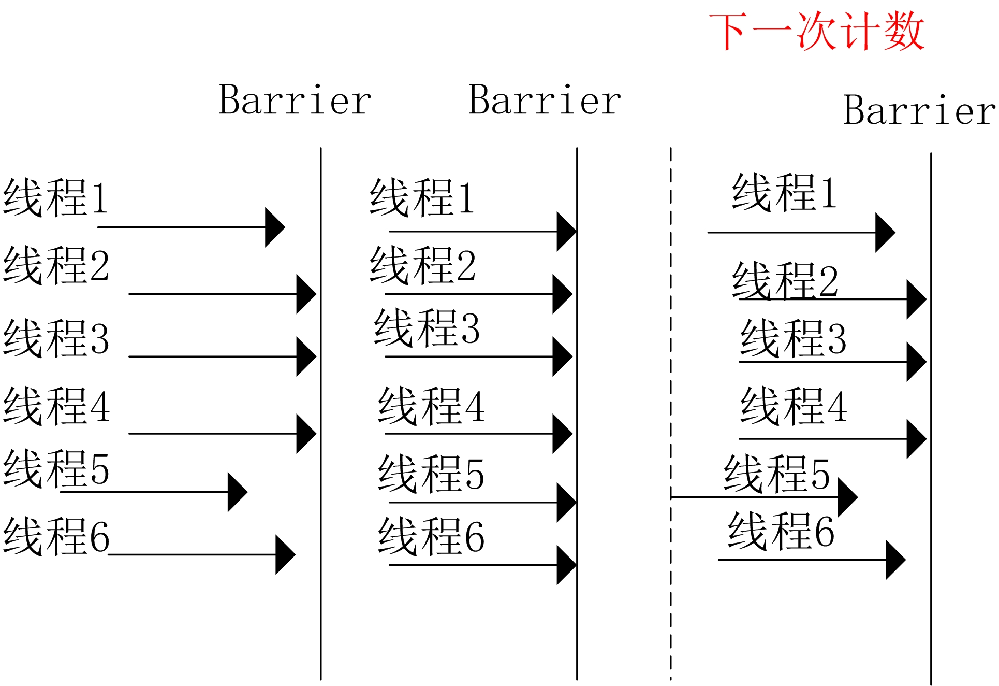

::: tip 说明

CountDownLatch与CyclicBarrier计数器

:::

<!-- more -->

[[toc]]

# CountDownLatch与CyclicBarrier计数器

# 1、CountDownLatch是什么

CountDownLatch是在java1.5被引入的，跟它一起被引入的并发工具类还有CyclicBarrier、Semaphore、ConcurrentHashMap和BlockingQueue，它们都存在于java.util.concurrent包下。CountDownLatch这个类能够使一个线程等待其他线程完成各自的工作后再执行。例如，应用程序的主线程希望在负责启动框架服务的线程已经启动所有的框架服务之后再执行。

CountDownLatch是通过一个计数器来实现的，计数器的初始值为线程的数量。每当一个线程完成了自己的任务后，计数器的值就会减1。当计数器值到达0时，它表示所有的线程已经完成了任务，然后在闭锁上等待的线程就可以恢复执行任务。

执行过程如下图所示：

 

# 2、CountDownLatch的使用

CountDownLatch的方法不是很多，将它们一个个列举出来：

1. `await() throws InterruptedException` ：调用该方法的线程等到构造方法传入的N减到0的时候，才能继续往下执行；
2. `await(long timeout, TimeUnit unit)` ：与上面的await方法功能一致，只不过这里有了时间限制，调用该方法的线程等到指定的timeout时间后，不管N是否减至为0，都会继续往下执行；
3. `countDown()` ：使CountDownLatch初始值N减1；
4. `long getCount()` ：获取当前CountDownLatch维护的值；

下面通过一个例子来说明一下CountDownLatch的使用，代码如下：

```java
public class CountDownLatchDemo {
private static CountDownLatch startSignal = new CountDownLatch(1);
//用来表示裁判员需要维护的是6个运动员
private static CountDownLatch endSignal = new CountDownLatch(6);

public static void main(String[] args) throws InterruptedException {
    ExecutorService executorService = Executors.newFixedThreadPool(6);
    for (int i = 0; i < 6; i++) {
        executorService.execute(() -> {
            try {
                System.out.println(Thread.currentThread().getName() + " 运动员等待裁判员响哨！！！");
                startSignal.await();
                System.out.println(Thread.currentThread().getName() + "正在全力冲刺");
                endSignal.countDown();
                System.out.println(Thread.currentThread().getName() + "  到达终点");
            } catch (InterruptedException e) {
                e.printStackTrace();
            }
        });
    }
    System.out.println("裁判员发号施令啦！！！");
    startSignal.countDown();
    endSignal.await();
    System.out.println("所有运动员到达终点，比赛结束！");
    executorService.shutdown();
}

输出结果：

pool-1-thread-2 运动员等待裁判员响哨！！！
pool-1-thread-3 运动员等待裁判员响哨！！！
pool-1-thread-1 运动员等待裁判员响哨！！！
pool-1-thread-4 运动员等待裁判员响哨！！！
pool-1-thread-5 运动员等待裁判员响哨！！！
pool-1-thread-6 运动员等待裁判员响哨！！！
裁判员发号施令啦！！！
pool-1-thread-2正在全力冲刺
pool-1-thread-2  到达终点
pool-1-thread-3正在全力冲刺
pool-1-thread-3  到达终点
pool-1-thread-1正在全力冲刺
pool-1-thread-1  到达终点
pool-1-thread-4正在全力冲刺
pool-1-thread-4  到达终点
pool-1-thread-5正在全力冲刺
pool-1-thread-5  到达终点
pool-1-thread-6正在全力冲刺
pool-1-thread-6  到达终点
所有运动员到达终点，比赛结束！
```

该示例代码中设置了两个CountDownLatch，第一个`endSignal`用于控制让main线程（裁判员）必须等到其他线程（运动员）让CountDownLatch维护的数值N减到0为止。另一个`startSignal`用于让main线程对其他线程进行“发号施令”，startSignal引用的CountDownLatch初始值为1，而其他线程执行的run方法中都会先通过 `startSignal.await()`让这些线程都被阻塞，直到main线程通过调用`startSignal.countDown();`，将值N减1，CountDownLatch维护的数值N为0后，其他线程才能往下执行，并且，每个线程执行的run方法中都会通过`endSignal.countDown();`对`endSignal`维护的数值进行减一，由于往线程池提交了6个任务，会被减6次，所以`endSignal`维护的值最终会变为0，因此main线程在`latch.await();`阻塞结束，才能继续往下执行。

另外，需要注意的是，当调用CountDownLatch的countDown方法时，当前线程是不会被阻塞，会继续往下执行，比如在该例中会继续输出`pool-1-thread-4 到达终点`。

# 3、AQS共享模式的实现

## CountDownLatch构造方法

CountDownLatch的构造方法如下：

```java
public CountDownLatch(int count) {
    if (count < 0) throw new IllegalArgumentException("count < 0");
    this.sync = new Sync(count);
}
```

传入一个参数count，CountDownLatch也使用了内部类Sync来实现，Sync继承自AQS：

```java
private static final class Sync extends AbstractQueuedSynchronizer {
    private static final long serialVersionUID = 4982264981922014374L;

    Sync(int count) {
        setState(count);
    }

    int getCount() {
        return getState();
    }

    protected int tryAcquireShared(int acquires) {
        return (getState() == 0) ? 1 : -1;
    }

    protected boolean tryReleaseShared(int releases) {
        // Decrement count; signal when transition to zero
        for (;;) {
            int c = getState();
            if (c == 0)
                return false;
            int nextc = c-1;
            if (compareAndSetState(c, nextc))
                return nextc == 0;
        }
    }
}
```

这里调用了AQS类中的setState方法来设置count，AQS的state属性在之前的文章已经提到，它是AQS中的状态标识，具体的含义由子类来定义，可见这里把state定义为数量。

## CountDownLatch的await方法

```java
public void await() throws InterruptedException {
    sync.acquireSharedInterruptibly(1);
}
```

直接调用了AQS类中的acquireSharedInterruptibly方法。

## acquireSharedInterruptibly方法

```java
public final void acquireSharedInterruptibly(int arg)
            throws InterruptedException {
    // 如果线程被中断则抛出异常
    if (Thread.interrupted())
        throw new InterruptedException();
    // 尝试获取共享锁，该方法在Sync类中实现
    if (tryAcquireShared(arg) < 0)
        // 如果获取失败，需要根据当前线程创建一个mode为SHARE的的Node放入队列中并循环获取
        doAcquireSharedInterruptibly(arg);
}
```

这里的tryAcquireShared方法在Sync中被重写。

## CountDownLatch的tryAcquireShared方法

```java
protected int tryAcquireShared(int acquires) {
    return (getState() == 0) ? 1 : -1;
}
```

仅仅是根据状态来判断，如果state等于0的时候，说明计数器为0了，返回1表示成功，否则返回-1表示失败。

## doAcquireSharedInterruptibly方法

```java
private void doAcquireSharedInterruptibly(int arg)
        throws InterruptedException {
    // 创建一个共享模式的节点
    final Node node = addWaiter(Node.SHARED);
    boolean failed = true;
    try {
        for (;;) {
            final Node p = node.predecessor();
            if (p == head) {
                // 如果 p == head 表示是队列的第一个节点，尝试获取
                int r = tryAcquireShared(arg);
                if (r >= 0) {
                    // 设置当前节点为head，并向后面的节点传播
                    setHeadAndPropagate(node, r);
                    p.next = null; // help GC
                    failed = false;
                    return;
                }
            }
            if (shouldParkAfterFailedAcquire(p, node) &&
                parkAndCheckInterrupt())
                throw new InterruptedException();
        }
    } finally {
        if (failed)
            cancelAcquire(node);
    }
}
```

这里的重点是setHeadAndPropagate方法。

## setHeadAndPropagate方法

```java
private void setHeadAndPropagate(Node node, int propagate) {
    Node h = head; // Record old head for check below
    setHead(node);
    /*
     * Try to signal next queued node if:
     *   Propagation was indicated by caller,
     *     or was recorded (as h.waitStatus either before
     *     or after setHead) by a previous operation
     *     (note: this uses sign-check of waitStatus because
     *      PROPAGATE status may transition to SIGNAL.)
     * and
     *   The next node is waiting in shared mode,
     *     or we don't know, because it appears null
     *
     * The conservatism in both of these checks may cause
     * unnecessary wake-ups, but only when there are multiple
     * racing acquires/releases, so most need signals now or soon
     * anyway.
     */
    if (propagate > 0 || h == null || h.waitStatus < 0 ||
        (h = head) == null || h.waitStatus < 0) {
        Node s = node.next;
        if (s == null || s.isShared())
            doReleaseShared();
    }
}
```

首先先将之前的head记录一下，用于下面的判断；然后设置当前节点为头节点；最后再判断是否需要唤醒。这里的propagate值是根据tryAcquireShared方法的返回值传入的，所以对于CountDownLatch来说，如果获取成功，则应该是1。

这里的if判断条件比较多，这里用了之前保存的head节点变量h来进行判断，让我疑惑的地方是，什么时候h会等于null？这个地方目前还没想明白。

如果`h.waitStatus >= 0`，表示是初始状态或者是取消状态，那么当`propagate <= 0`时将不唤醒节点。

获取node的下一个节点s，如果`s == null || s.isShared()`则释放节点并唤醒。为什么下一个节点为null的时候也需要唤醒操作呢？仔细理解一下这句话：

> The conservatism in both of these checks may cause unnecessary wake-ups, but only when there are multiple racing acquires/releases, so most need signals now or soon anyway.

这种保守的检查方式可能会引起多次不必要的线程唤醒操作，但这些情况仅存在于多线程并发的acquires/releases操作，所以大多线程数需要立即或者很快地一个信号。这个信号就是执行unpark方法。因为LockSupport在unpark的时候，相当于给了一个信号，即使这时候没有线程在park状态，之后有线程执行park的时候也会读到这个信号就不会被挂起。

在简单点说，就是线程在执行时，如果之前没有unpark操作，在执行park时会阻塞该线程；但如果在park之前执行过一次或多次unpark（unpark调用多次和一次是一样的，结果不会累加）这时执行park时并不会阻塞该线程。

所以，如果在唤醒node的时候下一个节点刚好添加到队列中，就可能避免了一次阻塞的操作。

所以这里的propagate表示传播，传播的过程就是只要成功的获取到共享所就唤醒下一个节点。

## doReleaseShared方法

```java
private void doReleaseShared() {
    /*
     * Ensure that a release propagates, even if there are other
     * in-progress acquires/releases.  This proceeds in the usual
     * way of trying to unparkSuccessor of head if it needs
     * signal. But if it does not, status is set to PROPAGATE to
     * ensure that upon release, propagation continues.
     * Additionally, we must loop in case a new node is added
     * while we are doing this. Also, unlike other uses of
     * unparkSuccessor, we need to know if CAS to reset status
     * fails, if so rechecking.
     */
    for (;;) {
        Node h = head;
        if (h != null && h != tail) {
            int ws = h.waitStatus;
            // 如果head的状态是SIGNAL，证明是等待一个信号，这时尝试将状态复位；
            // 如果复位成功，则唤醒下一节点，否则继续循环。
            if (ws == Node.SIGNAL) {
                if (!compareAndSetWaitStatus(h, Node.SIGNAL, 0))
                    continue;            // loop to recheck cases
                unparkSuccessor(h);
            }
            // 如果状态是0，尝试设置状态为传播状态，表示节点向后传播；
            // 如果不成功则继续循环。
            else if (ws == 0 &&
                     !compareAndSetWaitStatus(h, 0, Node.PROPAGATE))
                continue;                // loop on failed CAS
        }
        // 如果头节点有变化，则继续循环
        if (h == head)                   // loop if head changed
            break;
    }
}
```

什么时候状态会是SIGNAL呢？回顾一下shouldParkAfterFailedAcquire方法：

```java
private static boolean shouldParkAfterFailedAcquire(Node pred, Node node) {
    int ws = pred.waitStatus;
    if (ws == Node.SIGNAL)
        /*
         * This node has already set status asking a release
         * to signal it, so it can safely park.
         */
        return true;
    if (ws > 0) {
        /*
         * Predecessor was cancelled. Skip over predecessors and
         * indicate retry.
         */
        do {
            node.prev = pred = pred.prev;
        } while (pred.waitStatus > 0);
        pred.next = node;
    } else {
        /*
         * waitStatus must be 0 or PROPAGATE.  Indicate that we
         * need a signal, but don't park yet.  Caller will need to
         * retry to make sure it cannot acquire before parking.
         */
        compareAndSetWaitStatus(pred, ws, Node.SIGNAL);
    }
    return false;
}
```

当状态不为CANCEL或者是SIGNAL时，为了保险起见，这里把状态都设置成了SIGNAL，然后会再次循环进行判断是否需要阻塞。

回到doReleaseShared方法，这里为什么不直接把SIGNAL设置为PROPAGATE，而是先把SIGNAL设置为0，然后再设置为PROPAGATE呢？

原因在于unparkSuccessor方法，该方法会判断当前节点的状态是否小于0，如果小于0则将h的状态设置为0，如果在这里直接设置为PROPAGATE状态的话，则相当于多做了一次CAS操作。unparkSuccessor中的代码如下：

```java
int ws = node.waitStatus;
if (ws < 0)
    compareAndSetWaitStatus(node, ws, 0);
```

其实这里只判断状态为SIGNAL和0还有另一个原因，那就是当前执行doReleaseShared循环时的状态只可能为SIGNAL和0，因为如果这时没有后继节点的话，当前节点状态没有被修改，是初始的0；如果在执行setHead方法之前，这时刚好有后继节点被添加到队列中的话，因为这时后继节点判断`p == head`为false，所以会执行shouldParkAfterFailedAcquire方法，将当前节点的状态设置为SIGNAL。当状态为0时设置状态为PROPAGATE成功，则判断`h == head`结果为true，表示当前节点是队列中的唯一一个节点，所以直接就返回了；如果为false，则说明已经有后继节点的线程设置了head，这时不返回继续循环，但刚才获取的h已经用不到了，等待着被回收。

## CountDownLatch的countDown方法

```java
public void countDown() {
    sync.releaseShared(1);
}
```

这里是调用了AQS中的releaseShared方法。

## releaseShared方法

```java
public final boolean releaseShared(int arg) {
    // 尝试释放共享节点，如果成功则执行释放和唤醒操作
    if (tryReleaseShared(arg)) {
        doReleaseShared();
        return true;
    }
    return false;
}
```

这里调用的tryReleaseShared方法是在CountDownLatch中的Sync类重写的，而doReleaseShared方法已在上文中介绍过了。

## CountDownLatch的tryReleaseShared方法

```java
protected boolean tryReleaseShared(int releases) {
    // Decrement count; signal when transition to zero
    for (;;) {
        // 获取计数器数量
        int c = getState();
        // 为0是返回false表示不需要释放
        if (c == 0)
            return false;
        // 否则将计数器减1
        int nextc = c-1;
        if (compareAndSetState(c, nextc))
            return nextc == 0;
    }
}
```

这里设置state的操作需要循环来设置以确保成功。

## 超时控制的await方法

对应于上文中提到的doAcquireSharedInterruptibly方法，还有一个提供了超时控制的doAcquireSharedNanos方法，代码如下：

```java
private boolean doAcquireSharedNanos(int arg, long nanosTimeout)
            throws InterruptedException {
	if (nanosTimeout <= 0L)
	    return false;
	final long deadline = System.nanoTime() + nanosTimeout;
	final Node node = addWaiter(Node.SHARED);
	boolean failed = true;
	try {
	    for (;;) {
	        final Node p = node.predecessor();
	        if (p == head) {
	            int r = tryAcquireShared(arg);
	            if (r >= 0) {
	                setHeadAndPropagate(node, r);
	                p.next = null; // help GC
	                failed = false;
	                return true;
	            }
	        }
	        nanosTimeout = deadline - System.nanoTime();
	        if (nanosTimeout <= 0L)
	            return false;
	        if (shouldParkAfterFailedAcquire(p, node) &&
	            nanosTimeout > spinForTimeoutThreshold)
	            LockSupport.parkNanos(this, nanosTimeout);
	        if (Thread.interrupted())
	            throw new InterruptedException();
	    }
	} finally {
	    if (failed)
	        cancelAcquire(node);
	}
}
```

与doAcquireSharedInterruptibly方法新增了以下功能：

- 增加了一个deadline变量表示超时的截止时间，根据当前时间与传入的nanosTimeout计算得出；
- 每次循环判断是否已经超出截止时间，即`deadline - System.nanoTime()`是否大于0，大于0表示已经超时，返回false，小于0表示还未超时；
- 如果未超时通过调用shouldParkAfterFailedAcquire方法判断是否需要park，如果返回true则再判断`nanosTimeout > spinForTimeoutThreshold`，spinForTimeoutThreshold是自旋的最小阈值，这里被Doug Lea设置成了1000，表示1000纳秒，也就是说如果剩余的时间不足1000纳秒，则不需要park。

# 4、CountDownLatch总结

本文分析了CountDownLatch的实现同时也是对AQS共享模式的分析，实现方式如下：

**调用await时**

- 共享锁获取失败（计数器还不为0），则将该线程封装为一个Node对象放入队列中，并阻塞该线程；
- 共享锁获取成功（计数器为0），则从第一个节点开始依次唤醒后继节点，实现共享状态的传播。

**调用countDown时**

- 如果计数器不为0，则不释放，继续阻塞，并把state的值减1；
- 如果计数器为0，则唤醒节点，解除线程的阻塞状态。

> 在这里再对比一下独占模式和共享模式的相同点和不同点：

**相同点**

- 锁的获取和释放的判断都是由子类来实现的。

**不同点**

- 独占功能在获取节点之后并且还未释放时，其他的节点会一直阻塞，直到第一个节点被释放才会唤醒；
- 共享功能在获取节点之后会立即唤醒队列中的后继节点，每一个节点都会唤醒自己的后继节点，这就是共享状态的传播。

根据以上的总结可以看出，AQS不关心state具体是什么，含义由子类去定义，子类则根据该变量来进行获取和释放的判断，AQS只是维护了该变量，并且实现了一系列用来判断资源是否可以访问的API，它提供了对线程的入队和出队的操作，它还负责处理线程对资源的访问方式，例如：什么时候可以对资源进行访问，什么时候阻塞线程，什么时候唤醒线程，线程被取消后如何处理等。而子类则用来实现资源是否可以被访问的判断。

# 5、循环栅栏：CyclicBarrier

CyclicBarrier也是一种多线程并发控制的实用工具，和CountDownLatch一样具有等待计数的功能，但是相比于CountDownLatch功能更加强大。

为了理解CyclicBarrier，这里举一个通俗的例子。开运动会时，会有跑步这一项运动，我们来模拟下运动员入场时的情况，假设有6条跑道，在比赛开始时，就需要6个运动员在比赛开始的时候都站在起点了，裁判员吹哨后才能开始跑步。跑道起点就相当于“barrier”，是临界点，而这6个运动员就类比成线程的话，就是这6个线程都必须到达指定点了，意味着凑齐了一波，然后才能继续执行，否则每个线程都得阻塞等待，直至凑齐一波即可。cyclic是循环的意思，也就是说CyclicBarrier当多个线程凑齐了一波之后，仍然有效，可以继续凑齐下一波。CyclicBarrier的执行示意图如下：



当多个线程都达到了指定点后，才能继续往下继续执行。这就有点像报数的感觉，假设6个线程就相当于6个运动员，到赛道起点时会报数进行统计，如果刚好是6的话，这一波就凑齐了，才能往下执行。**CyclicBarrier在使用一次后，下面依然有效，可以继续当做计数器使用，这是与CountDownLatch的区别之一**。这里的6个线程，也就是计数器的初始值6，是通过CyclicBarrier的构造方法传入的。

下面来看下CyclicBarrier的主要方法：

```java
//等到所有的线程都到达指定的临界点
await() throws InterruptedException, BrokenBarrierException

//与上面的await方法功能基本一致，只不过这里有超时限制，阻塞等待直至到达超时时间为止
await(long timeout, TimeUnit unit) throws InterruptedException,
BrokenBarrierException, TimeoutException

//获取当前有多少个线程阻塞等待在临界点上
int getNumberWaiting()

//用于查询阻塞等待的线程是否被中断
boolean isBroken()


//将屏障重置为初始状态。如果当前有线程正在临界点等待的话，将抛出BrokenBarrierException。
void reset()
```

另外需要注意的是，CyclicBarrier提供了这样的构造方法：

```java
public CyclicBarrier(int parties, Runnable barrierAction)
```

可以用来，当指定的线程都到达了指定的临界点的时，接下来执行的操作可以由barrierAction传入即可。

> 一个例子

下面用一个简单的例子，来看下CyclicBarrier的用法，我们来模拟下上面的运动员的例子。

```java
public class CyclicBarrierDemo {
    //指定必须有6个运动员到达才行
    private static CyclicBarrier barrier = new CyclicBarrier(6, () -> {
        System.out.println("所有运动员入场，裁判员一声令下！！！！！");
    });
    public static void main(String[] args) {
        System.out.println("运动员准备进场，全场欢呼............");

        ExecutorService service = Executors.newFixedThreadPool(6);
        for (int i = 0; i < 6; i++) {
            service.execute(() -> {
                try {
                    System.out.println(Thread.currentThread().getName() + " 运动员，进场");
                    barrier.await();
                    System.out.println(Thread.currentThread().getName() + "  运动员出发");
                } catch (InterruptedException e) {
                    e.printStackTrace();
                } catch (BrokenBarrierException e) {
                    e.printStackTrace();
                }
            });
        }
    }

}

输出结果：
运动员准备进场，全场欢呼............
pool-1-thread-2 运动员，进场
pool-1-thread-1 运动员，进场
pool-1-thread-3 运动员，进场
pool-1-thread-4 运动员，进场
pool-1-thread-5 运动员，进场
pool-1-thread-6 运动员，进场
所有运动员入场，裁判员一声令下！！！！！
pool-1-thread-6  运动员出发
pool-1-thread-1  运动员出发
pool-1-thread-5  运动员出发
pool-1-thread-4  运动员出发
pool-1-thread-3  运动员出发
pool-1-thread-2  运动员出发
```

从输出结果可以看出，当6个运动员（线程）都到达了指定的临界点（barrier）时候，才能继续往下执行，否则，则会阻塞等待在调用`await()`处

# 6、CountDownLatch与CyclicBarrier的比较

CountDownLatch与CyclicBarrier都是用于控制并发的工具类，都可以理解成维护的就是一个计数器，但是这两者还是各有不同侧重点的：

1. CountDownLatch一般用于某个线程A等待若干个其他线程执行完任务之后，它才执行；而CyclicBarrier一般用于一组线程互相等待至某个状态，然后这一组线程再同时执行；CountDownLatch强调一个线程等多个线程完成某件事情。CyclicBarrier是多个线程互等，等大家都完成，再携手共进。
2. 调用CountDownLatch的countDown方法后，当前线程并不会阻塞，会继续往下执行；而调用CyclicBarrier的await方法，会阻塞当前线程，直到CyclicBarrier指定的线程全部都到达了指定点的时候，才能继续往下执行；
3. CountDownLatch方法比较少，操作比较简单，而CyclicBarrier提供的方法更多，比如能够通过getNumberWaiting()，isBroken()这些方法获取当前多个线程的状态，**并且CyclicBarrier的构造方法可以传入barrierAction**，指定当所有线程都到达时执行的业务功能；
4. CountDownLatch是不能复用的，而CyclicLatch是可以复用的。