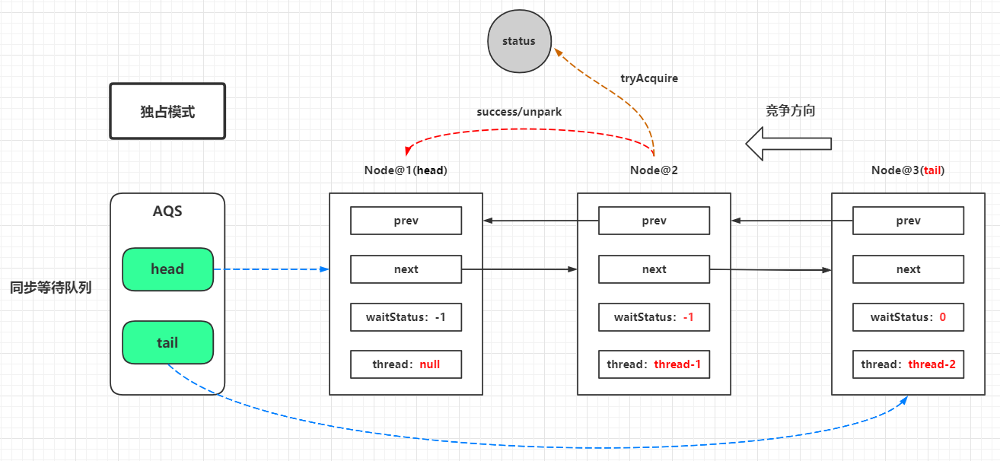
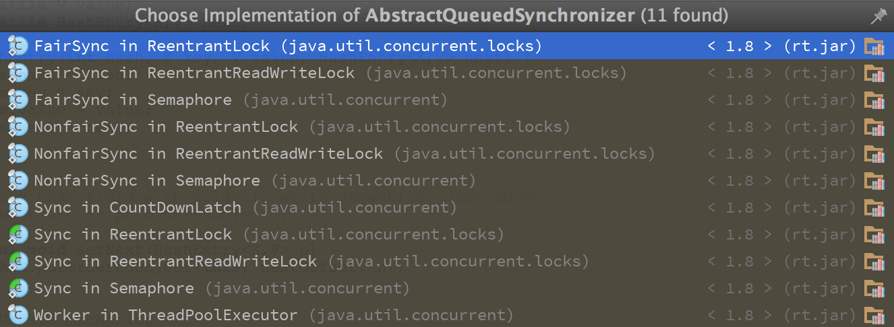
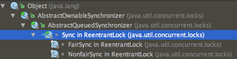
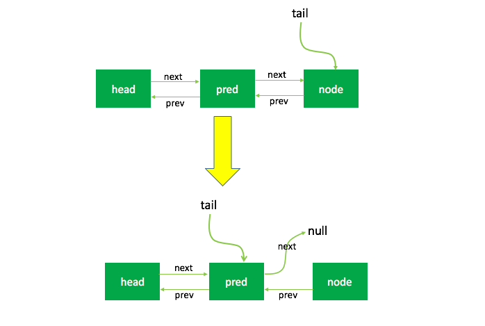
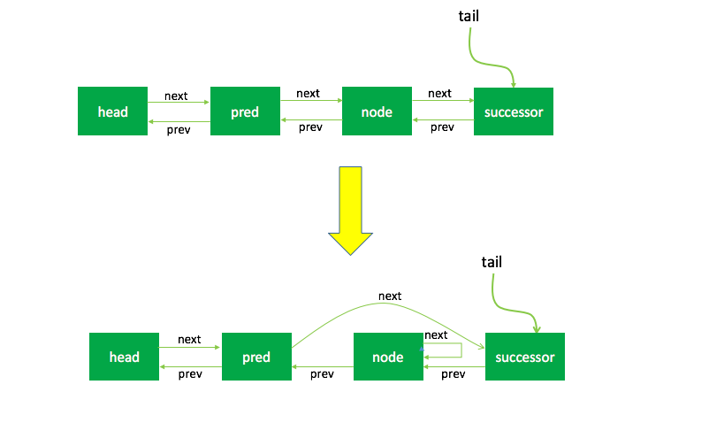
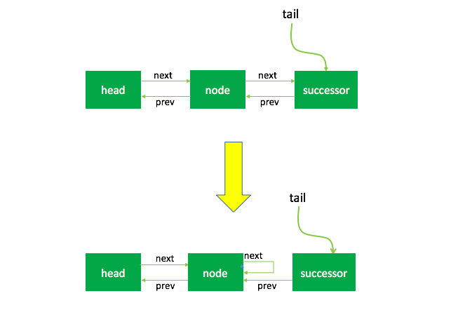

::: tip 说明

深入理解AbstractQueuedSynchronizer(AQS)

:::

<!-- more -->

[[toc]]

# 深入理解AbstractQueuedSynchronizer(AQS)



# 1、AQS简介

在上一篇文章中我们对lock和AbstractQueuedSynchronizer(AQS)有了初步的认识。在同步组件的实现中，AQS是核心部分，同步组件的实现者通过使用AQS提供的模板方法实现同步组件语义，AQS则实现了对**同步状态的管理，以及对阻塞线程进行排队，等待通知**等等一些底层的实现处理。AQS的核心也包括了这些方面：**同步队列，独占式锁的获取和释放，共享锁的获取和释放以及可中断锁，超时等待锁获取这些特性的实现**，而这些实际上则是AQS提供出来的模板方法，归纳整理如下：

AbstractQueuedSynchronizer提供了一个FIFO队列，可以看做是一个可以用来实现锁以及其他需要同步功能的框架。AQS的使用依靠继承来完成，子类通过继承自AQS并实现所需的方法来管理同步状态。例如ReentrantLock，CountDownLatch等。

本篇文章基于JDK1.8来介绍，该类有许多实现类：



其中，我们最常用的大概就是ReentrantLock和CountDownLatch了。ReentrantLock提供了对代码块的并发访问控制，也就是锁，说是锁，但其实并没有用到关键字`synchronized`，这么神奇？其实其内部就是基于同步器来实现的，本文结合ReentrantLock的使用来分析同步器独占锁的原理。

# 2、AQS的两种功能

从使用上来说，AQS的功能可以分为两种：独占和共享。对于这两种功能，有一个很常用的类：ReentrantReadWriteLock，其就是通过两个内部类来分别实现了这两种功能，提供了读锁和写锁的功能。但子类实现时，只能实现其中的一种功能，即要么是独占功能，要么是共享功能。

对于独占功能，例如如下代码：

```java
ReentrantLock lock = new ReentrantLock();
...

public void function(){

    lock.lock();
    try {

    // do something...


    } finally {
        lock.unlock();
    }

}
```

这个很好理解，通过ReentrantLock来保证在`lock.lock()`之后的代码在同一时刻只能有一个线程来执行，其余的线程将会被阻塞，直到该线程执行了`lock.unlock()`。这就是一个独占锁的功能。

对于共享功能，例如如下代码：

```java
ReentrantReadWriteLock lock = new ReentrantReadWriteLock();
...

public void function(){

    lock.readLock().lock();
    try {

    // do something...


    } finally {
        lock.readLock().unlock();
    }

}
```

代码中的`lock`是`ReentrantReadWriteLock`类的实例，而`lock.readLock()`为获取其中的读锁，即共享锁，使用方式并无差别，但和独占锁是有区别的：

- 读锁与读锁可以共享
- 读锁与写锁不可以共享（排他）
- 写锁与写锁不可以共享（排他）

# 3、AQS的主要数据结构

## 同步队列

当共享资源被某个线程占有，其他请求该资源的线程将会阻塞，从而进入同步队列。就数据结构而言，队列的实现方式无外乎两者一是通过数组的形式，另外一种则是链表的形式。AQS中的同步队列则是**通过链式方式**进行实现。接下来，很显然我们至少会抱有这样的疑问：

1. 节点的数据结构是什么样的？
2. 是单向还是双向？
3. 是带头结点的还是不带头节点的？

我们依旧先是通过看源码的方式：

在AQS有一个静态内部类Node，其中有这样一些属性：

```java
static final class Node {
    int waitStatus;
    Node prev;
    Node next;
    Node nextWaiter;
    Thread thread;
}
```

- *waitStatus*：表示节点的状态，其中包含的状态有：
  - *CANCELLED*：值为1，表示当前节点被取消；
  - *SIGNAL*：值为-1，表示当前节点的的后继节点将要或者已经被阻塞，在当前节点释放的时候需要unpark后继节点；
  - *CONDITION*：值为-2，表示当前节点在等待condition，即在condition队列中；
  - *PROPAGATE*：值为-3，表示releaseShared需要被传播给后续节点（仅在共享模式下使用）；
  - *0*：无状态，表示当前节点在队列中等待获取锁。
- *prev*：前继节点；
- *next*：后继节点；
- *nextWaiter*：存储condition队列中的后继节点；
- *thread*：当前线程。

节点是构成同步队列的基础，同步器拥有首节点（head）和尾节点（tail），没有成功获取同步状态的线程将会成为节点加入该队列的尾部，同步队列的基本结构如图所示：

 

如图，同步器包含了两个节点类型的引用，一个指向头节点，而另一个指向尾节点。试想一下，当一个线程成功地获取了同步状态（或者锁），其他线程将无法获取到同步状态，转而被构造成为节点并加入到同步队列中，而这个加入队列的过程必须要保证线程安全，因此同步器提供了一个基于CAS的设置尾节点的方法：compareAndSetTail(Node expect,Nodeupdate)，它需要传递当前线程“认为”的尾节点和当前节点，只有设置成功后，当前节点才正式与之前的尾节点建立关联。

 

同步队列遵循FIFO，首节点是获取同步状态成功的节点，首节点的线程在释放同步状态时，将会唤醒后继节点，而后继节点将会在获取同步状态成功时将自己设置为首节点，该过程如图所示：

 

如图，设置首节点是通过获取同步状态成功的线程来完成的，由于只有一个线程能够成功获取到同步状态，因此设置头节点的方法并不需要使用CAS来保证，它只需要将首节点设置成为原首节点的后继节点并断开原首节点的next引用即可。

现在我们可以清楚的知道这样几点：

1. **节点的数据结构，即AQS的静态内部类Node，节点的等待状态等信息**；
2. **同步队列是一个双向队列，AQS通过持有头尾指针管理同步队列**；
3. **节点的入队和出队实际上对应着锁的获取和释放两个操作：获取锁失败进行入队操作，获取锁成功进行出队操作。**

## AQS的state变量

AQS中有一个`state`变量，该变量对不同的子类实现具有不同的意义，对ReentrantLock来说，它表示加锁的状态：

- 无锁时state=0，有锁时state>0；
- 第一次加锁时，将state设置为1；
- 由于ReentrantLock是可重入锁，所以持有锁的线程可以多次加锁，经过判断加锁线程就是当前持有锁的线程时（即`exclusiveOwnerThread==Thread.currentThread()`），即可加锁，每次加锁都会将state的值+1，state等于几，就代表当前持有锁的线程加了几次锁；
- 解锁时每解一次锁就会将state减1，state减到0后，锁就被释放掉，这时其它线程可以加锁；
- 当持有锁的线程释放锁以后，如果是等待队列获取到了加锁权限，则会在等待队列头部取出第一个线程去获取锁，获取锁的线程会被移出队列；

`state`变量定义如下：

```java
/**
 * The synchronization state.
 */
private volatile int state;
```

# 4、ReentrantLock类的结构

下面通过ReentrantLock的实现进一步分析重入锁的实现。

首先看一下lock方法：

```java
public void lock() {
    sync.lock();
}
```

该方法调用了`sync`实例的lock方法，这里要说明一下ReentrantLock中的几个内部类：

- Sync
- FairSync
- NonfairSync

对于ReentrantLock，有两种获取锁的模式：公平锁和非公平锁。所以对应有两个内部类，都继承自Sync。而Sync继承自AQS：

 

本文主要通过公平锁来介绍，看一下FairSync的定义：

```java
/**
 * Sync object for fair locks
 */
static final class FairSync extends Sync {
    private static final long serialVersionUID = -3000897897090466540L;

    final void lock() {
        acquire(1);
    }

    /**
     * Fair version of tryAcquire.  Don't grant access unless
     * recursive call or no waiters or is first.
     */
    protected final boolean tryAcquire(int acquires) {
        final Thread current = Thread.currentThread();
        // 获取state
        int c = getState();
        // state=0表示当前队列中没有线程被加锁
        if (c == 0) {
            /*
             * 首先判断是否有前继结点，如果没有则当前队列中还没有其他线程；
             * 设置状态为acquires，即lock方法中写死的1（这里为什么不直接setState？因为可能同时有多个线程同时在执行到此处，所以用CAS来执行）；
             * 设置当前线程独占锁。
             */
            if (!hasQueuedPredecessors() &&
                compareAndSetState(0, acquires)) {
                setExclusiveOwnerThread(current);
                return true;
            }
        }
        /*
         * 如果state不为0，表示已经有线程独占锁了，这时还需要判断独占锁的线程是否是当前的线程，原因是由于ReentrantLock为可重入锁；
         * 如果独占锁的线程是当前线程，则将状态加1，并setState;
         * 这里为什么不用compareAndSetState？因为独占锁的线程已经是当前线程，不需要通过CAS来设置。
         */
        else if (current == getExclusiveOwnerThread()) {
            int nextc = c + acquires;
            if (nextc < 0)
                throw new Error("Maximum lock count exceeded");
            setState(nextc);
            return true;
        }
        return false;
    }
}
```

# 5、AQS获取独占锁的实现

## acquire方法

`acquire`是AQS中的方法，代码如下：

```java
public final void acquire(int arg) {
    if (!tryAcquire(arg) &&
        acquireQueued(addWaiter(Node.EXCLUSIVE), arg))
        selfInterrupt();
}
```

该方法主要工作如下：

1. 尝试获取独占锁；
2. 获取成功则返回，否则执行步骤3;
3. addWaiter方法将当前线程封装成Node对象，并添加到队列尾部；
4. 自旋获取锁，并判断中断标志位。如果中断标志位为`true`，执行步骤5，否则返回；
5. 设置线程中断。

## tryAcquire方法

`tryAcquire`方法在FairSync中已经说明，它重写了AQS中的方法，在AQS中它的定义如下：

```java
protected boolean tryAcquire(int arg) {
    throw new UnsupportedOperationException();
}
```

既然该方法需要子类来实现，为什么不使用`abstract`来修饰呢？上文中提到过，AQS有两种功能：独占和共享，而且子类只能实现其一种功能，所以，如果使用`abstract`来修饰，那么每个子类都需要同时实现两种功能的方法，这对子类来说不太友好，所以没有使用`abstract`来修饰。

该方法是在ReentrantLock中的FairSync和NonfairSync的两个内部类来实现的，这里以FairSysc-公平锁来说明：

```java
protected final boolean tryAcquire(int acquires) {
    final Thread current = Thread.currentThread();
    int c = getState();
    if (c == 0) {
        if (!hasQueuedPredecessors() &&
            compareAndSetState(0, acquires)) {
            setExclusiveOwnerThread(current);
            return true;
        }
    }
    else if (current == getExclusiveOwnerThread()) {
        int nextc = c + acquires;
        if (nextc < 0)
            throw new Error("Maximum lock count exceeded");
        setState(nextc);
        return true;
    }
    return false;
}
```

## addWaiter方法

看下addWaiter方法的定义：

```java
private Node addWaiter(Node mode) {
    // 根据当前线程创建一个Node对象
    Node node = new Node(Thread.currentThread(), mode);
    // Try the fast path of enq; backup to full enq on failure
    Node pred = tail;
    // 判断tail是否为空，如果为空表示队列是空的，直接enq
    if (pred != null) {
        node.prev = pred;
        // 这里尝试CAS来设置队尾，如果成功则将当前节点设置为tail，否则enq
        if (compareAndSetTail(pred, node)) {
            pred.next = node;
            return node;
        }
    }
    enq(node);
    return node;
}
```

分析可以看上面的注释。程序的逻辑主要分为两个部分：

1. 当前同步队列的尾节点为null，调用方法enq()插入;
2. 当前队列的尾节点不为null，则采用尾插入（compareAndSetTail()方法）的方式入队。

另外还会有另外一个问题：如果 `if (compareAndSetTail(pred, node))`为false怎么办？会继续执行到enq()方法，同时很明显compareAndSetTail是一个CAS操作，通常来说如果CAS操作失败会继续自旋（死循环）进行重试。因此，经过我们这样的分析，enq()方法可能承担两个任务：

1. 处理当前同步队列尾节点为null时进行入队操作；
2. 如果CAS尾插入节点失败后负责自旋进行尝试。那么是不是真的就像我们分析的一样了？只有源码会告诉我们答案。

## enq方法

```java
private Node enq(final Node node) {
    // 重复直到成功
    for (;;) {
        Node t = tail;
        // 如果tail为null，则必须创建一个Node节点并进行初始化
        if (t == null) { // Must initialize
            if (compareAndSetHead(new Node()))
                tail = head;
        } else {
            node.prev = t;
            // 尝试CAS来设置队尾
            if (compareAndSetTail(t, node)) {
                t.next = node;
                return t;
            }
        }
    }
}
```

在上面的分析中我们可以看出会先创建头结点，说明同步队列是**带头结点的链式存储结构**。带头结点与不带头结点相比，会在入队和出队的操作中获得更大的便捷性，因此同步队列选择了带头结点的链式存储结构。那么带头节点的队列初始化时机是什么？自然而然是在**tail为null时，即当前线程是第一次插入同步队列**。compareAndSetTail(t, node)方法会利用CAS操作设置尾节点，如果CAS操作失败会在`for (;;)`死循环中不断尝试，直至成功return返回为止。因此，对enq()方法可以做这样的总结：

1. **在当前线程是第一个加入同步队列时，调用compareAndSetHead(new Node())方法，完成链式队列的头结点的初始化**；
2. **自旋不断尝试CAS尾插入节点直至成功为止**。

现在我们已经很清楚获取独占式锁失败的线程包装成Node然后插入同步队列的过程了？那么紧接着会有下一个问题？在同步队列中的节点（线程）会做什么事情了来保证自己能够有机会获得独占式锁了？带着这样的问题我们就来看看acquireQueued()方法。

## acquireQueued方法

该方法的功能是循环的尝试获取锁，直到成功为止，最后返回中断标志位。

```java
final boolean acquireQueued(final Node node, int arg) {
    boolean failed = true;
    try {
        boolean interrupted = false;
        for (;;) {
            // 1. 获得当前节点的先驱节点
            final Node p = node.predecessor();
            // 2. 当前节点能否获取独占式锁
            // 2.1 如果当前节点的先驱节点是头结点并且成功获取同步状态，即可以获得独占式锁
            if (p == head && tryAcquire(arg)) {
                //队列头指针用指向当前节点
                setHead(node);
                //释放前驱节点
                p.next = null; // help GC
                failed = false;
                return interrupted;
            }
            // 2.2 获取锁失败，线程进入等待状态等待获取独占式锁
            if (shouldParkAfterFailedAcquire(p, node) &&
                parkAndCheckInterrupt())
                interrupted = true;
        }
    } finally {
        if (failed)
            cancelAcquire(node);
    }
}
```

程序逻辑通过注释已经标出，整体来看这是一个这又是一个自旋的过程（for (;;)），代码首先获取当前节点的先驱节点，**如果先驱节点是头结点的并且成功获得同步状态的时候（if (p == head && tryAcquire(arg))），当前节点所指向的线程能够获取锁**。反之，获取锁失败进入等待状态。整体示意图为下图：

 

获取锁的节点出队的逻辑是acquireQueued方法中的如下代码：

```java
//队列头结点引用指向当前节点
setHead(node);
//释放前驱节点
p.next = null; // help GC
failed = false;
return interrupted;
```

setHead()方法为：

```java
private void setHead(Node node) {
    head = node;
    node.thread = null;
    node.prev = null;
}Copy to clipboardErrorCopied
```

将当前节点通过setHead()方法设置为队列的头结点，然后将之前的头结点的next域设置为null并且pre域也为null，即与队列断开，无任何引用方便GC时能够将内存进行回收。示意图如下：

 

## 获取锁失败

那么当获取锁失败的时候会调用`shouldParkAfterFailedAcquire()`方法和`parkAndCheckInterrupt()`方法，看看他们做了什么事情。看下`shouldParkAfterFailedAcquire`方法的代码：

```java
private static boolean shouldParkAfterFailedAcquire(Node pred, Node node) {
    int ws = pred.waitStatus;
    if (ws == Node.SIGNAL)
        /*
         * This node has already set status asking a release
         * to signal it, so it can safely park.
         */
        return true;
    if (ws > 0) {
        /*
         * Predecessor was cancelled. Skip over predecessors and
         * indicate retry.
         */
        do {
            node.prev = pred = pred.prev;
        } while (pred.waitStatus > 0);
        pred.next = node;
    } else {
        /*
         * waitStatus must be 0 or PROPAGATE.  Indicate that we
         * need a signal, but don't park yet.  Caller will need to
         * retry to make sure it cannot acquire before parking.
         */
        compareAndSetWaitStatus(pred, ws, Node.SIGNAL);
    }
    return false;
}
```

`shouldParkAfterFailedAcquire()`方法主要逻辑是使用`compareAndSetWaitStatus(pred, ws, Node.SIGNAL)`使用CAS将节点状态由INITIAL设置成SIGNAL，表示当前线程阻塞。当compareAndSetWaitStatus设置失败则说明shouldParkAfterFailedAcquire方法返回false，然后会在`acquireQueued()`方法中`for (;;)`死循环中会继续重试，直至compareAndSetWaitStatus设置节点状态位为SIGNAL时shouldParkAfterFailedAcquire返回true时才会执行方法`parkAndCheckInterrupt()`方法，该方法的源码为：

```java
private final boolean parkAndCheckInterrupt() {
    LockSupport.park(this);
    return Thread.interrupted();
}
```

该方法的关键是会调用`LookSupport.park()`方法（关于LookSupport会在以后的文章进行讨论），该方法是用来阻塞当前线程的，然后返回线程的中断状态并复位中断状态。

> 注意`interrupted()`方法的作用，该方法是获取线程的中断状态，并复位，也就是说，如果当前线程是中断状态，则第一次调用该方法获取的是`true`，第二次则是`false`。而isInterrupted()方法则只是返回线程的中断状态，不执行复位操作。

如果acquireQueued执行完毕，返回中断状态，回到acquire方法中，根据返回的中断状态判断是否需要执行`Thread.currentThread().interrupt()`。

为什么要多做这一步呢？先判断中断状态，然后复位，如果之前线程是中断状态，再进行中断？

这里就要介绍一下park方法了。park方法是Unsafe类中的方法，与之对应的是unpark方法。简单来说，当前线程如果执行了park方法，也就是阻塞了当前线程，反之，unpark就是唤醒一个线程。

具体的说明请参考[博客](http://blog.csdn.net/hengyunabc/article/details/28126139)

park与wait的作用类似，但是对中断状态的处理并不相同。如果当前线程不是中断的状态，park与wait的效果是一样的；如果一个线程是中断的状态，这时执行wait方法会报`java.lang.IllegalMonitorStateException`，而执行park时并不会报异常，而是直接返回。

所以，知道了这一点，就可以知道为什么要进行中断状态的复位了：

- 如果当前线程是非中断状态，则在执行park时被阻塞，这是返回中断状态是`false`；
- 如果当前线程是中断状态，则park方法不起作用，会立即返回，然后parkAndCheckInterrupt方法会获取中断的状态，也就是`true`，并复位；
- 再次执行循环的时候，由于在前一步已经把该线程的中断状态进行了复位，则再次调用park方法时会阻塞。

所以，这里判断线程中断的状态实际上是为了不让循环一直执行，要让当前线程进入阻塞的状态。想象一下，如果不这样判断，前一个线程在获取锁之后执行了很耗时的操作，那么岂不是要一直执行该死循环？这样就造成了CPU使用率飙升，这是很严重的后果。

## cancelAcquire方法

在acquireQueued方法的finally语句块中，如果在循环的过程中出现了异常，则执行cancelAcquire方法，用于将该节点标记为取消状态。该方法代码如下：

```java
private void cancelAcquire(Node node) {
    // Ignore if node doesn't exist
    if (node == null)
        return;
    // 设置该节点不再关联任何线程
    node.thread = null;

    // Skip cancelled predecessors
    // 通过前继节点跳过取消状态的node
    Node pred = node.prev;
    while (pred.waitStatus > 0)
        node.prev = pred = pred.prev;

    // predNext is the apparent node to unsplice. CASes below will
    // fail if not, in which case, we lost race vs another cancel
    // or signal, so no further action is necessary.
    // 获取过滤后的前继节点的后继节点
    Node predNext = pred.next;

    // Can use unconditional write instead of CAS here.
    // After this atomic step, other Nodes can skip past us.
    // Before, we are free of interference from other threads.
    // 设置状态为取消状态
    node.waitStatus = Node.CANCELLED;

    /*
     * If we are the tail, remove ourselves.
     * 1.如果当前节点是tail：
     * 尝试更新tail节点，设置tail为pred；
     * 更新失败则返回，成功则设置tail的后继节点为null
     */
    if (node == tail && compareAndSetTail(node, pred)) {
        compareAndSetNext(pred, predNext, null);
    } else {
        // If successor needs signal, try to set pred's next-link
        // so it will get one. Otherwise wake it up to propagate.
        int ws;
        /*
         * 2.如果当前节点不是head的后继节点：
         * 判断当前节点的前继节点的状态是否是SIGNAL，如果不是则尝试设置前继节点的状态为SIGNAL；
         * 上面两个条件如果有一个返回true，则再判断前继节点的thread是否不为空；
         * 若满足以上条件，则尝试设置当前节点的前继节点的后继节点为当前节点的后继节点，也就是相当于将当前节点从队列中删除
         */
        if (pred != head &&
            ((ws = pred.waitStatus) == Node.SIGNAL ||
             (ws <= 0 && compareAndSetWaitStatus(pred, ws, Node.SIGNAL))) &&
            pred.thread != null) {
            Node next = node.next;
            if (next != null && next.waitStatus <= 0)
                compareAndSetNext(pred, predNext, next);
        } else {
            // 3.如果是head的后继节点或者状态判断或设置失败，则唤醒当前节点的后继节点
            unparkSuccessor(node);
        }

        node.next = node; // help GC
    }
}
```

该方法中执行的过程有些复杂，首先是要获取当前节点的前继节点，如果前继节点的状态不是取消状态（即`pred.waitStatus > 0`），则向前遍历队列，直到遇到第一个`waitStatus <= 0`的节点，并把当前节点的前继节点设置为该节点，然后设置当前节点的状态为取消状态。

接下来的工作可以分为3种情况：

- 当前节点是tail；
- 当前节点不是head的后继节点（即队列的第一个节点，不包括head），也不是tail；
- 当前节点是head的后继节点。

我们依次来分析一下：

**当前节点是tail**

这种情况很简单，因为tail是队列的最后一个节点，如果该节点需要取消，则直接把该节点的前继节点的next指向null，也就是把当前节点移除队列。出队的过程如下：

 

注意：经验证，这里并没有设置node的prev为null。

**当前节点不是head的后继节点，也不是tail**

 

这里将node的前继节点的next指向了node的后继节点，真正执行的代码就是如下一行：

```java
compareAndSetNext(pred, predNext, next);
```

**当前节点是head的后继节点**

 

这里直接unpark后继节点的线程，然后将next指向了自己。

这里可能会有疑问，既然要删除节点，为什么都没有对prev进行操作，而仅仅是修改了next？

要明确的一点是，这里修改指针的操作都是CAS操作，在AQS中所有以`compareAndSet`开头的方法都是尝试更新，并不保证成功，图中所示的都是执行成功的情况。

那么在执行cancelAcquire方法时，当前节点的前继节点有可能已经执行完并移除队列了（参见`setHead`方法），所以在这里只能用CAS来尝试更新，而就算是尝试更新，也只能更新next，不能更新prev，因为prev是不确定的，否则有可能会导致整个队列的不完整，例如把prev指向一个已经移除队列的node。

什么时候修改prev呢？其实prev是由其他线程来修改的。回去看下shouldParkAfterFailedAcquire方法，该方法有这样一段代码：

```java
do {
    node.prev = pred = pred.prev;
} while (pred.waitStatus > 0);
pred.next = node;
```

该段代码的作用就是通过prev遍历到第一个不是取消状态的node，并修改prev。

这里为什么可以更新prev？因为shouldParkAfterFailedAcquire方法是在获取锁失败的情况下才能执行，因此进入该方法时，说明已经有线程获得锁了，并且在执行该方法时，当前节点之前的节点不会变化（因为只有当下一个节点获得锁的时候才会设置head），所以这里可以更新prev，而且不必用CAS来更新。

## AQS获取独占锁的大致流程图

经过上面的分析，独占式锁的获取过程也就是`acquire()`方法的执行流程如下图所示：

 方法的执行流程.svg)

# 6、AQS释放独占锁的实现

释放通过unlock方法来实现：

```java
public void unlock() {
    sync.release(1);
}
```

该方法调用了release方法，release是在AQS中定义的，看下release代码：

```java
public final boolean release(int arg) {
    // 尝试释放锁
    if (tryRelease(arg)) {
        // 释放成功后unpark后继节点的线程
        Node h = head;
        if (h != null && h.waitStatus != 0)
            unparkSuccessor(h);
        return true;
    }
    return false;
}
```

这里首先尝试着去释放锁，成功了之后要去唤醒后继节点的线程，这样其他的线程才有机会去执行。

tryRelease代码如下：

```java
protected boolean tryRelease(int arg) {
    throw new UnsupportedOperationException();
}
```

是不是和tryAcquire方法类似？该方法也需要被重写，在Sync类中的代码如下：

```java
protected final boolean tryRelease(int releases) {
    // 这里是将锁的数量减1
    int c = getState() - releases;
    // 如果释放的线程和获取锁的线程不是同一个，抛出非法监视器状态异常
    if (Thread.currentThread() != getExclusiveOwnerThread())
        throw new IllegalMonitorStateException();
    boolean free = false;
    // 由于重入的关系，不是每次释放锁c都等于0，
    // 直到最后一次释放锁时，才会把当前线程释放
    if (c == 0) {
        free = true;
        setExclusiveOwnerThread(null);
    }
    // 记录锁的数量
    setState(c);
    return free;
}
```

当前线程被释放之后，需要唤醒下一个节点的线程，通过unparkSuccessor方法来实现：

```java
private void unparkSuccessor(Node node) {
    /*
     * If status is negative (i.e., possibly needing signal) try
     * to clear in anticipation of signalling.  It is OK if this
     * fails or if status is changed by waiting thread.
     */
    int ws = node.waitStatus;
    if (ws < 0)
        compareAndSetWaitStatus(node, ws, 0);

    /*
     * Thread to unpark is held in successor, which is normally
     * just the next node.  But if cancelled or apparently null,
     * traverse backwards from tail to find the actual
     * non-cancelled successor.
     */
    Node s = node.next;
    if (s == null || s.waitStatus > 0) {
        s = null;
        for (Node t = tail; t != null && t != node; t = t.prev)
            if (t.waitStatus <= 0)
                s = t;
    }
    if (s != null)
        LockSupport.unpark(s.thread);
}
```

主要功能就是要唤醒下一个线程，这里`s == null || s.waitStatus > 0`判断后继节点是否为空或者是否是取消状态，然后从队列尾部向前遍历找到最前面的一个waitStatus小于0的节点，至于为什么从尾部开始向前遍历，回想一下cancelAcquire方法的处理过程，cancelAcquire只是设置了next的变化，没有设置prev的变化，在最后有这样一行代码：`node.next = node`，如果这时执行了unparkSuccessor方法，并且向后遍历的话，就成了死循环了，所以这时只有prev是稳定的。

到这里，通过ReentrantLock的lock和unlock来分析AQS独占锁的实现已经基本完成了，但ReentrantLock还有一个非公平锁NonfairSync。

其实NonfairSync和FairSync主要就是在获取锁的方式上不同，公平锁是按顺序去获取，而非公平锁是抢占式的获取，lock的时候先去尝试修改state变量，如果抢占成功，则获取到锁：

```java
final void lock() {
    if (compareAndSetState(0, 1))
        setExclusiveOwnerThread(Thread.currentThread());
    else
        acquire(1);
}
```

非公平锁的tryAcquire方法调用了nonfairTryAcquire方法：

```java
final boolean nonfairTryAcquire(int acquires) {
    final Thread current = Thread.currentThread();
    int c = getState();
    if (c == 0) {
        if (compareAndSetState(0, acquires)) {
            setExclusiveOwnerThread(current);
            return true;
        }
    }
    else if (current == getExclusiveOwnerThread()) {
        int nextc = c + acquires;
        if (nextc < 0) // overflow
            throw new Error("Maximum lock count exceeded");
        setState(nextc);
        return true;
    }
    return false;
}
```

该方法比公平锁的tryAcquire方法在第二个if判断中少了一个是否存在前继节点判断，FairSync中的tryAcquire代码中的这个if语句块如下：

```java
if (!hasQueuedPredecessors() &&
    compareAndSetState(0, acquires)) {
    setExclusiveOwnerThread(current);
    return true;
}
```

到现在我们终于啃下了一块硬骨头了，通过学习源码的方式非常深刻的学习到了独占式锁的获取和释放的过程以及同步队列。可以做一下总结：

1. **线程获取锁失败，线程被封装成Node进行入队操作，核心方法在于addWaiter()和enq()，同时enq()完成对同步队列的头结点初始化工作以及CAS操作失败的重试**;
2. **线程获取锁是一个自旋的过程，只有当前节点的前驱节点是头结点并且成功获得同步状态时，节点出队即该节点引用的线程获得锁，否则，当不满足条件时就会调用LookSupport.park()方法使得线程阻塞**；
3. **释放锁的时候会唤醒后继节点；**

总体来说：**在获取同步状态时，AQS维护一个同步队列，获取同步状态失败的线程会加入到队列中进行自旋；移除队列（或停止自旋）的条件是前驱节点是头结点并且成功获得了同步状态。在释放同步状态时，同步器会调用unparkSuccessor()方法唤醒后继节点。**

# 7、独占锁特性学习

## 可中断式获取锁（acquireInterruptibly方法）

我们知道lock相较于synchronized有一些更方便的特性，比如能响应中断以及超时等待等特性，现在我们依旧采用通过学习源码的方式来看看能够响应中断是怎么实现的。可响应中断式锁可调用方法lock.lockInterruptibly();而该方法其底层会调用AQS的acquireInterruptibly方法，源码为：

```java
public final void acquireInterruptibly(int arg) throws InterruptedException {
    if (Thread.interrupted())
        throw new InterruptedException();
    if (!tryAcquire(arg))
        //线程获取锁失败
        doAcquireInterruptibly(arg);
}
```

在获取同步状态失败后就会调用doAcquireInterruptibly方法：

```java
private void doAcquireInterruptibly(int arg)
    throws InterruptedException {
    //将节点插入到同步队列中
    final Node node = addWaiter(Node.EXCLUSIVE);
    boolean failed = true;
    try {
        for (;;) {
            final Node p = node.predecessor();
            //获取锁出队
            if (p == head && tryAcquire(arg)) {
                setHead(node);
                p.next = null; // help GC
                failed = false;
                return;
            }
            if (shouldParkAfterFailedAcquire(p, node) &&
                parkAndCheckInterrupt())
                //线程中断抛异常
                throw new InterruptedException();
        }
    } finally {
        if (failed)
            cancelAcquire(node);
    }
}
```

关键信息请看注释，现在看这段代码就很轻松了，与acquire方法逻辑几乎一致，唯一的区别是当**parkAndCheckInterrupt**返回true时即线程阻塞时该线程被中断，代码抛出被中断异常。

## 超时等待式获取锁（tryAcquireNanos()方法）

通过调用lock.tryLock(timeout,TimeUnit)方式达到超时等待获取锁的效果，该方法会在三种情况下才会返回：

1. 在超时时间内，当前线程成功获取了锁；
2. 当前线程在超时时间内被中断；
3. 超时时间结束，仍未获得锁返回false。

我们仍然通过采取阅读源码的方式来学习底层具体是怎么实现的，该方法会调用AQS的方法tryAcquireNanos(),源码为：

```java
public final boolean tryAcquireNanos(int arg, long nanosTimeout) throws InterruptedException {
    if (Thread.interrupted())
        throw new InterruptedException();
    return tryAcquire(arg) ||
        //实现超时等待的效果
        doAcquireNanos(arg, nanosTimeout);
}
```

很显然这段源码最终是靠doAcquireNanos方法实现超时等待的效果，该方法源码如下：

```java
private boolean doAcquireNanos(int arg, long nanosTimeout) throws InterruptedException {
    if (nanosTimeout <= 0L)
        return false;
    //1. 根据超时时间和当前时间计算出截止时间
    final long deadline = System.nanoTime() + nanosTimeout;
    final Node node = addWaiter(Node.EXCLUSIVE);
    boolean failed = true;
    try {
        for (;;) {
            final Node p = node.predecessor();
            //2. 当前线程获得锁出队列
            if (p == head && tryAcquire(arg)) {
                setHead(node);
                p.next = null; // help GC
                failed = false;
                return true;
            }
            // 3.1 重新计算超时时间
            nanosTimeout = deadline - System.nanoTime();
            // 3.2 已经超时返回false
            if (nanosTimeout <= 0L)
                return false;
            // 3.3 线程阻塞等待
            if (shouldParkAfterFailedAcquire(p, node) &&
                nanosTimeout > spinForTimeoutThreshold)
                LockSupport.parkNanos(this, nanosTimeout);
            // 3.4 线程被中断抛出被中断异常
            if (Thread.interrupted())
                throw new InterruptedException();
        }
    } finally {
        if (failed)
            cancelAcquire(node);
    }
}
```

程序逻辑如图所示：

 方法）.png ':size=60%')

程序逻辑同独占锁可响应中断式获取基本一致，唯一的不同在于获取锁失败后，对超时时间的处理上，在第1步会先计算出按照现在时间和超时时间计算出理论上的截止时间，比如当前时间是8h10min，超时时间是10min，那么根据`deadline = System.nanoTime() + nanosTimeout`计算出刚好达到超时时间时的系统时间就是8h 10min+10min = 8h 20min。然后根据`deadline - System.nanoTime()`就可以判断是否已经超时了，比如，当前系统时间是8h 30min很明显已经超过了理论上的系统时间8h 20min，`deadline - System.nanoTime()`计算出来就是一个负数，自然而然会在3.2步中的If判断之间返回false。如果还没有超时即3.2步中的if判断为true时就会继续执行3.3步通过**LockSupport.parkNanos**使得当前线程阻塞，同时在3.4步增加了对中断的检测，若检测出被中断直接抛出被中断异常。

# 8、共享锁

## 共享锁的获取（acquireShared()方法）

在聊完AQS对独占锁的实现后，我们继续一鼓作气的来看看共享锁是怎样实现的？共享锁的获取方法为acquireShared，源码为：

```java
public final void acquireShared(int arg) {
    if (tryAcquireShared(arg) < 0)
        doAcquireShared(arg);
}
```

这段源码的逻辑很容易理解，在该方法中会首先调用tryAcquireShared方法，tryAcquireShared返回值是一个int类型，当返回值为大于等于0的时候方法结束说明获得成功获取锁，否则，表明获取同步状态失败即所引用的线程获取锁失败，会执行doAcquireShared方法，该方法的源码为：

```java
private void doAcquireShared(int arg) {
    final Node node = addWaiter(Node.SHARED);
    boolean failed = true;
    try {
        boolean interrupted = false;
        for (;;) {
            final Node p = node.predecessor();
            if (p == head) {
                int r = tryAcquireShared(arg);
                if (r >= 0) {
                    // 当该节点的前驱节点是头结点且成功获取同步状态
                    setHeadAndPropagate(node, r);
                    p.next = null; // help GC
                    if (interrupted)
                        selfInterrupt();
                    failed = false;
                    return;
                }
            }
            if (shouldParkAfterFailedAcquire(p, node) &&
                parkAndCheckInterrupt())
                interrupted = true;
        }
    } finally {
        if (failed)
            cancelAcquire(node);
    }
}
```

现在来看这段代码会不会很容易了？逻辑几乎和独占式锁的获取一模一样，这里的自旋过程中能够退出的条件**是当前节点的前驱节点是头结点并且tryAcquireShared(arg)返回值大于等于0即能成功获得同步状态**。

## 共享锁的释放（releaseShared()方法）

共享锁的释放在AQS中会调用方法releaseShared：

```java
public final boolean releaseShared(int arg) {
    if (tryReleaseShared(arg)) {
        doReleaseShared();
        return true;
    }
    return false;
}
```

当成功释放同步状态之后即tryReleaseShared会继续执行doReleaseShared方法：

```java
private void doReleaseShared() {
    /*
     * Ensure that a release propagates, even if there are other
     * in-progress acquires/releases.  This proceeds in the usual
     * way of trying to unparkSuccessor of head if it needs
     * signal. But if it does not, status is set to PROPAGATE to
     * ensure that upon release, propagation continues.
     * Additionally, we must loop in case a new node is added
     * while we are doing this. Also, unlike other uses of
     * unparkSuccessor, we need to know if CAS to reset status
     * fails, if so rechecking.
     */
    for (;;) {
        Node h = head;
        if (h != null && h != tail) {
            int ws = h.waitStatus;
            if (ws == Node.SIGNAL) {
                if (!compareAndSetWaitStatus(h, Node.SIGNAL, 0))
                    continue;            // loop to recheck cases
                unparkSuccessor(h);
            }
            else if (ws == 0 &&
                     !compareAndSetWaitStatus(h, 0, Node.PROPAGATE))
                continue;                // loop on failed CAS
        }
        if (h == head)                   // loop if head changed
            break;
    }
}
```

这段方法跟独占式锁释放过程有点点不同，在共享式锁的释放过程中，对于能够支持多个线程同时访问的并发组件，必须保证多个线程能够安全的释放同步状态，这里采用的CAS保证，当CAS操作失败continue，在下一次循环中进行重试。

## 可中断（acquireSharedInterruptibly()方法），超时等待（tryAcquireSharedNanos()方法）

关于可中断锁以及超时等待的特性其实现和独占式锁可中断获取锁以及超时等待的实现几乎一致，具体的就不再说了，如果理解了上面的内容对这部分的理解也是水到渠成的。

> 参考文献

《java并发编程的艺术》

[深入理解AbstractQueuedSynchronizer（一）](http://www.ideabuffer.cn/2017/03/15/%E6%B7%B1%E5%85%A5%E7%90%86%E8%A7%A3AbstractQueuedSynchronizer%EF%BC%88%E4%B8%80%EF%BC%89/)
